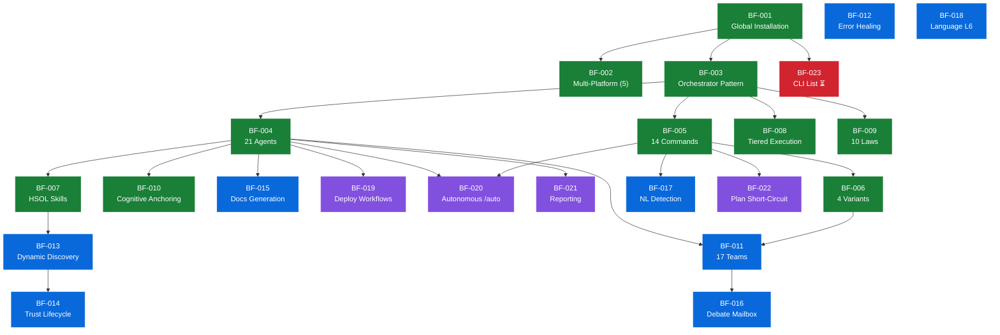
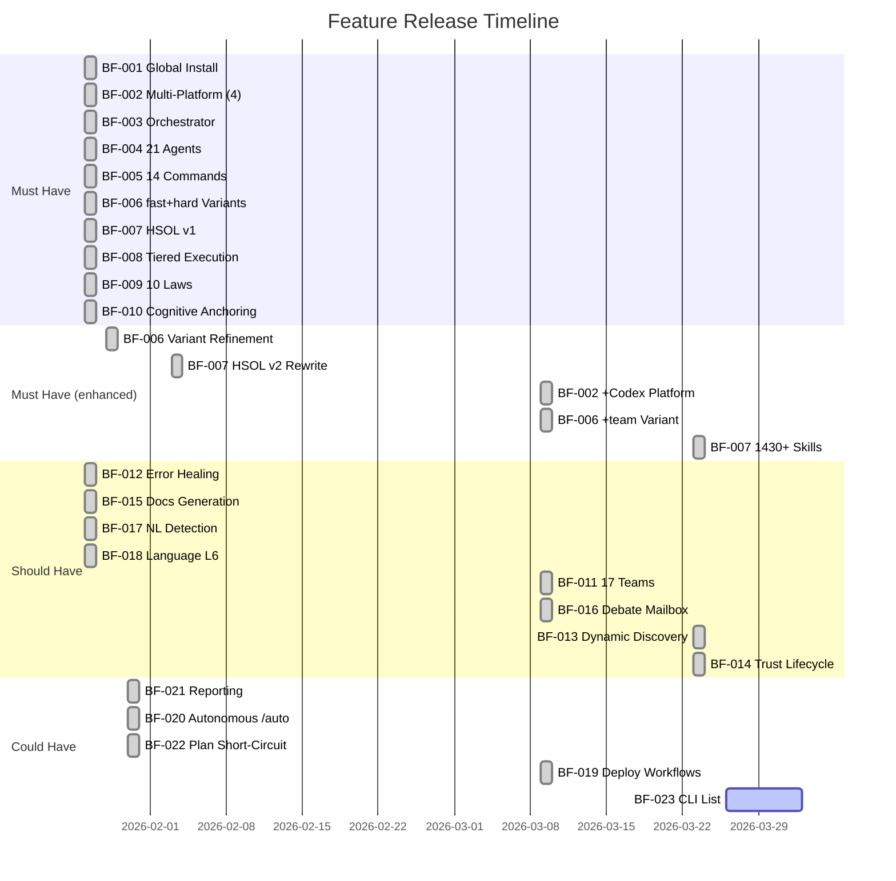

# BoomOpen Workflow Kit — Dependencies and Release Sequencing

> **Purpose**: Feature dependency graph, release history mapping, and recommended rollout order for new installations
> **Parent**: [00-index.md](./00-index.md)
> **Last Updated**: 2026-03-26
> **Generated By**: docs-business skill

---

## Feature Dependency Graph



**Legend**: 🟢 Must Have | 🔵 Should Have | 🟣 Could Have | 🔴 Pending

---

## Dependency Matrix

| Feature | Depends On | Depended On By |
|---------|-----------|----------------|
| BF-001 | (none — root) | BF-002, BF-003, BF-023 |
| BF-002 | BF-001 | (none) |
| BF-003 | BF-001 | BF-004, BF-005, BF-008, BF-009 |
| BF-004 | BF-003 | BF-007, BF-010, BF-011, BF-015, BF-019, BF-020, BF-021 |
| BF-005 | BF-003, BF-004 | BF-006, BF-017, BF-020, BF-022 |
| BF-006 | BF-005 | BF-011 |
| BF-007 | BF-004 | BF-013 |
| BF-008 | BF-003 | (none) |
| BF-009 | BF-003 | (none) |
| BF-010 | BF-004 | (none) |
| BF-011 | BF-004, BF-006 | BF-016 |
| BF-012 | (none — standalone) | (none) |
| BF-013 | BF-007 | BF-014 |
| BF-014 | BF-013 | (none) |
| BF-015 | BF-004, BF-005 | (none) |
| BF-016 | BF-011 | (none) |
| BF-017 | BF-005 | (none) |
| BF-018 | (none — standalone) | (none) |
| BF-019 | BF-004 | (none) |
| BF-020 | BF-004, BF-005 | (none) |
| BF-021 | BF-004 | (none) |
| BF-022 | BF-005 | (none) |
| BF-023 | BF-001 | (none) |

### Standalone Features (No Inbound Dependencies)

- **BF-012** (Error Self-Healing) — Defined in `rules/ERRORS.md`; operates independently
- **BF-018** (Language Compliance) — CORE.md law; no feature dependency

### Critical Path

The longest dependency chain determines the minimum sequential delivery order:

```
BF-001 → BF-003 → BF-004 → BF-007 → BF-013 → BF-014
  (6 features deep)
```

All features on this chain must ship in order. Parallel branches (BF-005→BF-006→BF-011→BF-016 and BF-008, BF-009, BF-010) can ship concurrently once their immediate dependency is met.

---

## Release History — Features per Version

### v1.0.0 (2026-01-26) — Foundation Release

| Feature | Description |
|---------|-------------|
| BF-001 | One-Time Global Installation |
| BF-002 | Multi-Platform Support (Cursor, Copilot, Claude, Antigravity — 4 platforms) |
| BF-003 | Orchestrator Pattern |
| BF-004 | 21 Specialist Agents |
| BF-005 | 14 Structured Commands |
| BF-006 | Variant Strategies (`:fast`, `:hard` — partial) |
| BF-007 | Matrix Skill Discovery (HSOL v1) |
| BF-008 | Tiered Execution |
| BF-009 | 10 Orchestration Laws |
| BF-010 | Cognitive Anchoring |
| BF-012 | Error Self-Healing (E1–E4) |
| BF-015 | Documentation Generation (/docs) |
| BF-017 | Natural Language Command Detection |
| BF-018 | Language Compliance (L6) |

**14 features delivered. All 10 Must Have features shipped in v1.0.0.**

---

### v1.0.2 (2026-01-28) — Variant Expansion

| Feature | Description |
|---------|-------------|
| BF-006 | Team variant capability expanded for build and fix workflows |

---

### v1.0.3 (2026-01-30) — Reporter

| Feature | Description |
|---------|-------------|
| BF-021 | Reporting System (/report command + reporter agent) |

---

### v1.0.4 (2026-01-30) — Autonomy & Optimization

| Feature | Description |
|---------|-------------|
| BF-020 | Autonomous Execution (/auto command) |
| BF-022 | Plan Short-Circuit (skip research when plan exists) |

---

### v1.1.0 (2026-02-03) — HSOL v2

| Feature | Description |
|---------|-------------|
| BF-007 | Matrix Skills rewrite — 19 domains, HSOL v2 algorithm |

**Major enhancement of existing feature, not a new feature.**

---

### v1.2.0 (2026-03-09) — Teams & Codex

| Feature | Description |
|---------|-------------|
| BF-002 | 5th platform: Codex added |
| BF-006 | `:team` variant added |
| BF-011 | 17 Domain Teams (Golden Triangle) |
| BF-016 | Debate Mechanism (Mailbox) |
| BF-019 | Deployment Workflows (/deploy) |

**5 features delivered/enhanced. Largest feature release since v1.0.0.**

---

### v1.3.0 (2026-03-23) — Smart Skills

| Feature | Description |
|---------|-------------|
| BF-007 | 1,430+ skills (expanded from 310+) |
| BF-013 | Dynamic Skill Discovery |
| BF-014 | Trust Progression Lifecycle |

---

### Not Yet Released

| Feature | Description | Blocker |
|---------|------------|---------|
| BF-023 | CLI List Command | No blocker — low priority (Could Have) |

---

## Release Timeline Visualization



---

## Recommended Rollout Order for New Installations

For teams adopting boomopen-workflow-kit for the first time, the recommended rollout sequence introduces features in dependency-safe batches:

### Phase 1 — Foundation (Day 1)

| Feature | Reason |
|---------|--------|
| BF-001 | Install the framework |
| BF-002 | Configure target platforms |
| BF-003 | Orchestrator loads at first session |
| BF-004 | All 21 agents available immediately |
| BF-009 | Laws enforce governance from session 1 |
| BF-010 | Cognitive anchoring active in every agent |

**Result**: Users can delegate tasks to specialist agents. All Must Have foundations in place.

### Phase 2 — Structured Workflows (Day 1–2)

| Feature | Reason |
|---------|--------|
| BF-005 | Learn core commands (start with `/cook`, `/fix`, `/test`) |
| BF-006 | Start with `:fast` variant; graduate to `:hard` |
| BF-008 | Tiered execution auto-detected per platform |
| BF-012 | Error handling active from first run |
| BF-017 | Natural language reduces learning curve |
| BF-018 | Language compliance for international teams |

**Result**: Full command workflow available. Users productive with structured development.

### Phase 3 — Knowledge Layer (Week 1)

| Feature | Reason |
|---------|--------|
| BF-007 | HSOL skill injection enriches agent output |
| BF-015 | Generate project documentation |
| BF-022 | Use plans to skip redundant research |

**Result**: Agents produce domain-specific, high-quality output. Documentation generated.

### Phase 4 — Advanced Quality (Week 2+)

| Feature | Reason |
|---------|--------|
| BF-011 | Introduce `:team` variant for critical features |
| BF-016 | Debate mechanism ensures adversarial review |
| BF-013 | Dynamic discovery extends skill coverage |
| BF-014 | Trust lifecycle governs community skills |
| BF-019 | Structured deployment for production releases |
| BF-020 | Autonomous execution for experienced users |
| BF-021 | Automated reporting for team visibility |

**Result**: Full framework capability. Adversarial quality, ecosystem skills, deployment automation.

---

## Evidence Sources

| Source | Path |
|--------|------|
| CHANGELOG (release history) | [../../CHANGELOG.md](../../CHANGELOG.md) |
| Structured Business Pack | [../../reports/business-analysis/structured-business-pack.md](../../reports/business-analysis/structured-business-pack.md) |
| Knowledge overview — features | [../knowledge-overview/03-features.md](../knowledge-overview/03-features.md) |
| PRD — goals and scope | [../business-prd/02-problem-goals-and-scope.md](../business-prd/02-problem-goals-and-scope.md) |
| CORE rules | [../../rules/CORE.md](../../rules/CORE.md) |
| SKILLS rules | [../../rules/SKILLS.md](../../rules/SKILLS.md) |
| TEAMS rules | [../../rules/TEAMS.md](../../rules/TEAMS.md) |
| CLI installer | [../../cli/install.js](../../cli/install.js) |
