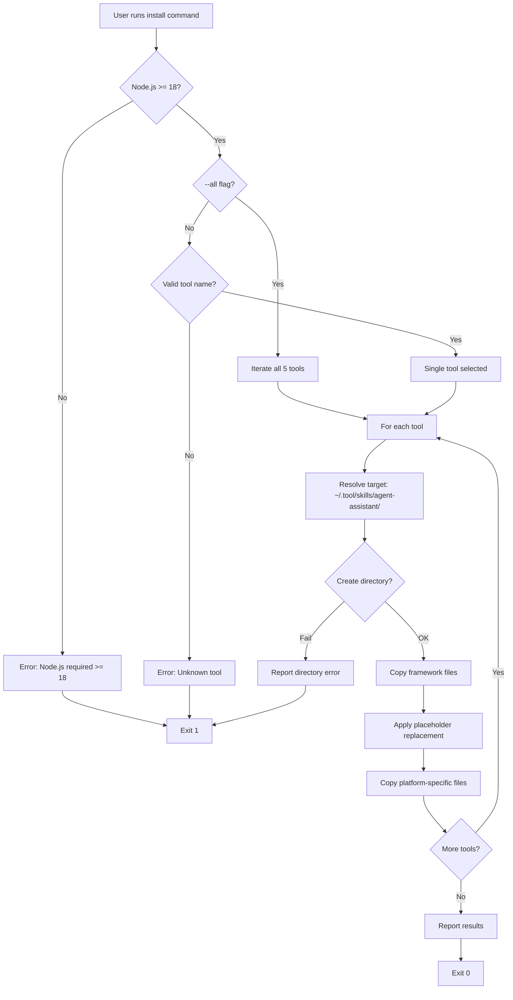
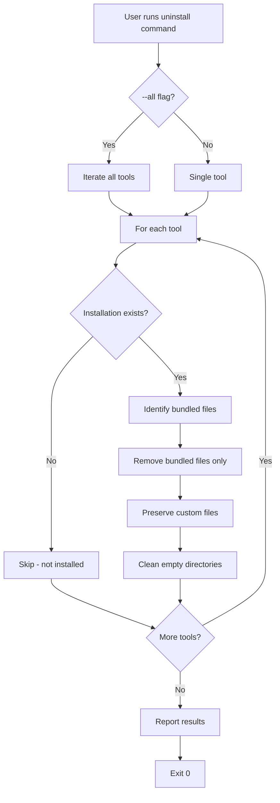
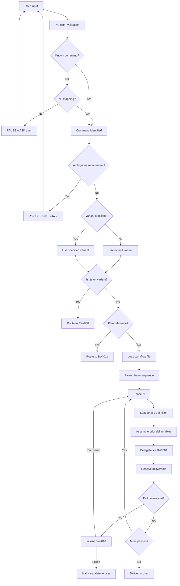
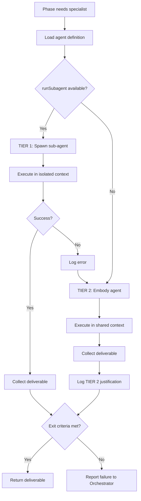
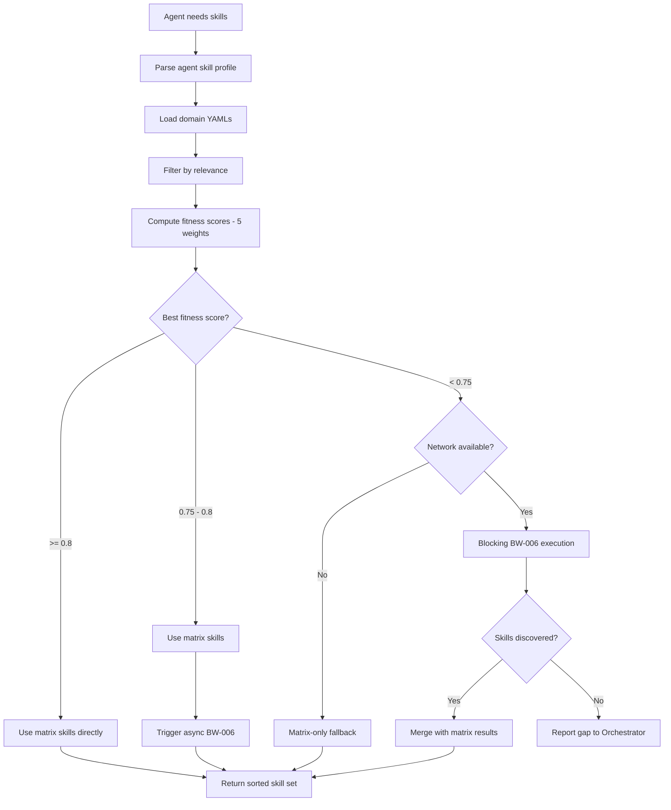
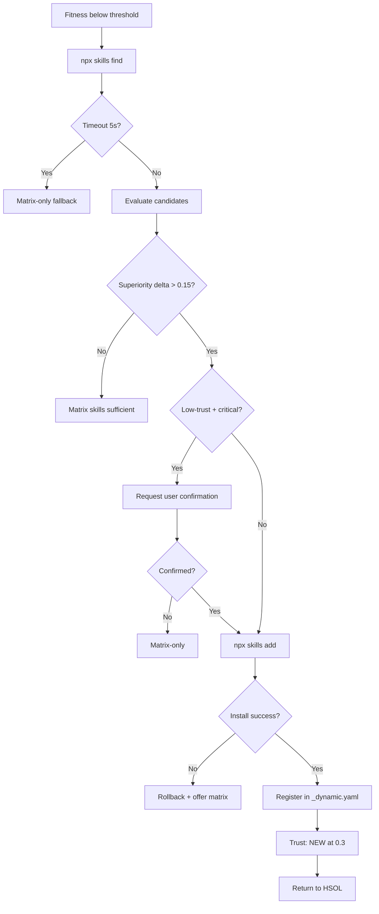
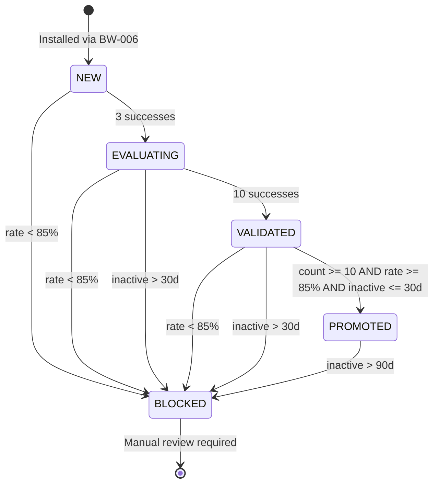
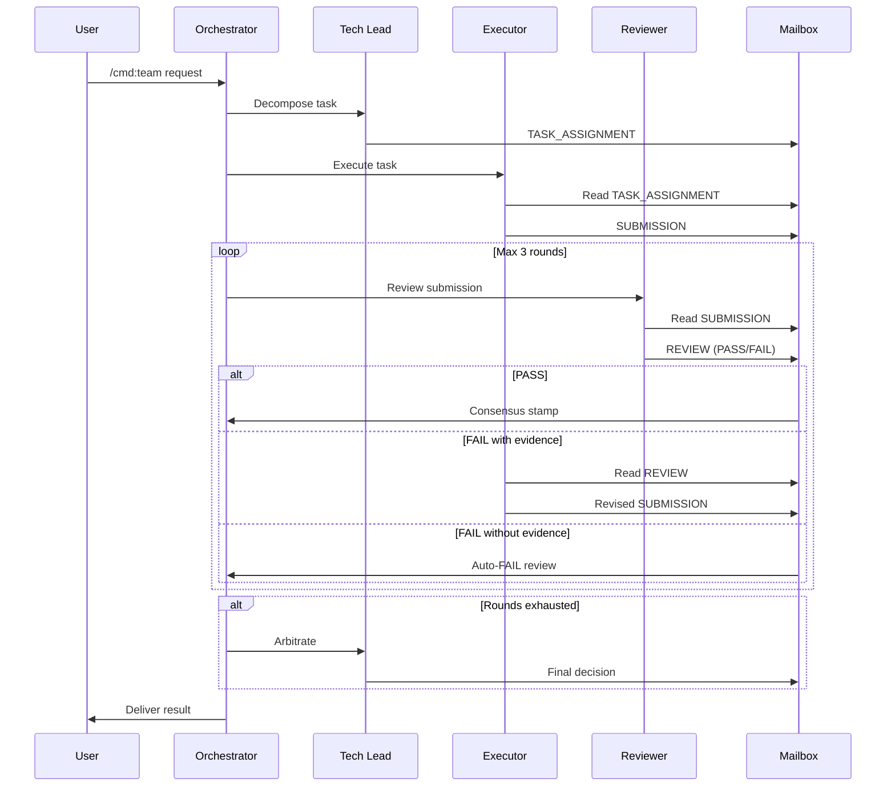
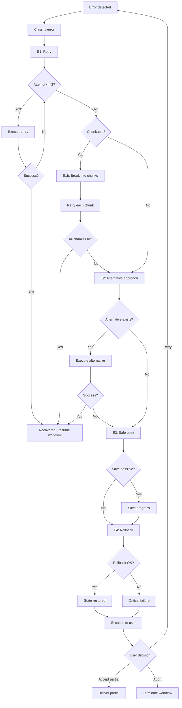
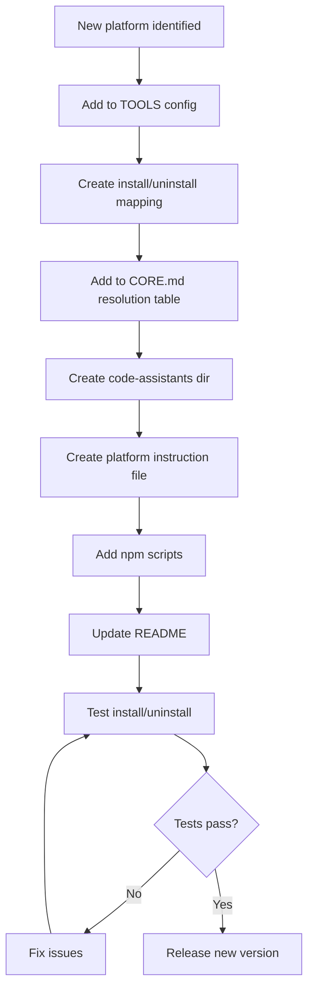

# Agent Assistant — Detailed Workflows

| Field | Value |
|-------|-------|
| **Purpose** | Step-by-step flow definitions with Mermaid diagrams, decision points, branching, and error paths |
| **Parent** | [00-index.md](00-index.md) |
| **Last Updated** | 2026-03-26 |
| **Generated By** | docs-business skill |

---

## BW-001 — Framework Installation

### Narrative

The Framework User runs the CLI to install framework files into their AI coding assistant's configuration directory. The installer validates prerequisites, resolves target paths, copies files with placeholder replacement, and reports success or failure.

### Steps

1. User executes `agent-assistant install <tool>` or `agent-assistant install --all`
2. CLI validates Node.js version (>=18)
3. CLI validates `<tool>` against known TOOLS list (claude, copilot, cursor, codex, gemini)
4. For each target tool:
   a. Resolve target directory: `~/.{tool}/skills/agent-assistant/`
   b. Create directory structure if not exists
   c. Copy framework files (agents, commands, rules, skills, matrix-skills)
   d. Apply placeholder replacement in copied files
   e. Copy platform-specific instruction file from `code-assistants/{tool}-assistant/`
5. Report per-tool success/failure
6. Exit with code 0 (all succeeded) or 1 (any failed)

### Decision Points

- **D1**: Is Node.js >=18 installed? → No: error message + exit 1
- **D2**: Is `<tool>` valid? → No: "Unknown tool" + exit 1
- **D3**: `--all` flag? → Yes: iterate all tools; No: single tool
- **D4**: Directory creation succeeded? → No: report error + exit 1

### Mermaid Diagram



---

## BW-002 — Framework Uninstallation

### Narrative

The Framework User removes installed framework files while preserving any custom user files that were not part of the original installation bundle.

### Steps

1. User executes `agent-assistant uninstall <tool>` or `agent-assistant uninstall --all`
2. CLI validates tool name(s)
3. For each target tool:
   a. Check if installation directory exists at `~/.{tool}/skills/agent-assistant/`
   b. If not exists → skip with informational message
   c. Identify bundled files (from manifest)
   d. Remove only bundled files
   e. Preserve custom/user-created files
   f. Remove empty directories
4. Report results

### Decision Points

- **D1**: Installation exists? → No: skip
- **D2**: File is bundled? → Yes: remove; No: preserve



---

## BW-003 — Command Execution (Standard)

### Narrative

This is the core workflow of the framework. When a user types a command (explicit or natural language), the Orchestrator performs pre-flight validation, routes to the correct command and variant, then executes phases sequentially. Each phase is delegated to a specialist agent via BW-004. Every phase must pass exit criteria before the next begins.

### Steps

1. User input received (prompt or natural language)
2. **Pre-flight**: Orchestrator validates input is actionable
3. **Command Detection**: Match input to command (`/cook`, `/fix`, `/plan`, etc.) or natural language mapping
4. **Variant Resolution**: Determine variant (`:easy`, `:hard`, `:team`, etc.) — default if unspecified
5. **Workflow File Load**: Read `commands/{cmd}.md` → `commands/{cmd}/{variant}.md`
6. **Phase Initialization**: Parse phase sequence from workflow file
7. **For each phase (sequential)**:
   a. Load phase definition (agent, exit criteria, inputs)
   b. Assemble context from prior phase deliverables (immutable — Law 8)
   c. Delegate to specialist agent via BW-004
   d. Receive deliverable from agent
   e. Verify exit criteria
   f. If criteria not met → halt or retry (BW-010)
   g. Store deliverable for subsequent phases
8. **Delivery**: Present final deliverable to user

### Decision Points

- **D1**: Is input a known command? → No: attempt NL mapping → still no: ASK user
- **D2**: Is requirement ambiguous? → Yes: PAUSE + ASK (Law 2)
- **D3**: Variant specified? → No: use default variant
- **D4**: Is this a `:team` variant? → Yes: route to BW-008
- **D5**: Exit criteria met? → No: invoke BW-010 error recovery
- **D6**: Plan reference detected? → Yes: route to BW-011

### Mermaid Diagram



---

## BW-004 — Agent Delegation (Tiered)

### Narrative

When a phase requires specialist work, the Orchestrator delegates through a two-tier system. TIER 1 (isolated sub-agent) is always preferred. TIER 2 (embodiment in shared context) is a fallback only when TIER 1 is unavailable or fails.

### Steps

1. Orchestrator identifies agent for current phase
2. Load agent definition from `agents/{agent}.md`
3. Check if `runSubagent` capability is available
4. **TIER 1 path**: Spawn isolated sub-agent with scoped context → execute → collect deliverable
5. **TIER 2 path** (fallback): Embody agent persona in shared context → execute → collect deliverable → log TIER 2 justification
6. Verify deliverable meets phase exit criteria
7. Return deliverable to Orchestrator



---

## BW-005 — Skill Resolution (HSOL)

### Narrative

The HSOL system resolves which skills an agent should use for a given task. It combines static matrix lookups with dynamic discovery and trust-weighted scoring. Three fitness bands determine the resolution path: matrix-only (≥0.8), matrix + async discovery (0.75–0.8), and blocking discovery (<0.75).

### Steps

1. Agent assigned to phase signals skill need
2. Parse agent's skill profile from agent definition
3. Load relevant domain YAML files from `matrix-skills/`
4. Filter skills by relevance to current task context
5. Compute fitness score for each candidate using 5-weight algorithm:
   - Domain match weight
   - Keyword overlap weight
   - Complexity alignment weight
   - Trust level weight
   - Recency weight
6. Determine best fitness score
7. **Route by fitness band**:
   - **≥0.8**: Use matrix skills directly
   - **0.75–0.8**: Use matrix skills + trigger async BW-006
   - **<0.75**: Blocking — execute BW-006 synchronously before proceeding
8. Return sorted skill set to agent

### Decision Points

- **D1**: Fitness ≥0.8? → matrix-only
- **D2**: Fitness 0.75–0.8? → matrix + async discovery
- **D3**: Fitness <0.75? → blocking discovery required
- **D4**: Network available? → No: matrix-only fallback
- **D5**: Any skills found? → No: report gap

### Mermaid Diagram



---

## BW-006 — Dynamic Skill Discovery

### Narrative

When HSOL fitness is below threshold, the system searches external registries for potentially superior skills, evaluates them, and conditionally installs them with user confirmation for critical low-trust scenarios.

### Steps

1. BW-005 triggers discovery (fitness < 0.8)
2. Execute `npx skills find` with task context query
3. Evaluate returned candidates against current matrix skills
4. Check superiority delta: candidate must exceed current best by >0.15
5. If low-trust skill + critical task: request user confirmation
6. Execute `npx skills add` to install selected skill
7. Register new skill in `_dynamic.yaml` with NEW trust level (0.3)
8. Return skill to HSOL for inclusion in resolution set

### Exception Paths

- Timeout (5s) → abandon discovery, use matrix-only
- Install failure → rollback + offer matrix alternatives
- User declines confirmation → use matrix-only



---

## BW-007 — Trust Progression

### Narrative

Every dynamically discovered skill goes through a trust lifecycle. Trust progresses through successful executions and decays through inactivity or poor performance.

### State Machine

| State | Value | Entry Condition | Exit Condition |
|-------|-------|-----------------|----------------|
| NEW | 0.3 | Installed via BW-006 | 3 successive successes |
| EVALUATING | 0.5 | 3 successive successes | 10 successive successes |
| VALIDATED | 0.7 | 10 successive successes | count≥10, rate≥85%, inactive≤30d |
| PROMOTED | 1.0 | All promotion criteria met | — (terminal success state) |
| BLOCKED | 0.0 | rate<85% OR inactive>30d | Manual review (future) |

### Decay Rules

- Inactive >30 days → transition to BLOCKED regardless of current state
- 90-day inactivity → full trust decay to 0.0
- Success rate <85% at any evaluation checkpoint → BLOCKED



---

## BW-008 — Team Collaboration (Golden Triangle)

### Narrative

When a user invokes a `:team` variant, three specialist agents collaborate through a structured Mailbox protocol. The Tech Lead decomposes the task, the Executor implements, and the Reviewer critiques. Disagreements are resolved through up to 3 debate rounds, after which the Tech Lead arbitrates.

### Steps

1. Orchestrator receives `:team` variant command
2. Orchestrator spawns Tech Lead agent
3. **Tech Lead**: Decomposes task into TASK_ASSIGNMENT message
4. TASK_ASSIGNMENT posted to Mailbox
5. Orchestrator spawns Executor agent (domain-specific)
6. **Executor**: Reads assignment from Mailbox → implements → posts SUBMISSION to Mailbox
7. Orchestrator spawns Reviewer agent
8. **Reviewer**: Reads submission → critiques → posts REVIEW (PASS or FAIL with evidence)
9. **If PASS**: Consensus stamp applied → deliverable released to Orchestrator
10. **If FAIL**: 
    a. Executor reads review → defends or fixes → new SUBMISSION
    b. Reviewer re-reviews → new REVIEW
    c. Repeat up to 3 rounds
11. **If 3 rounds exhausted**: Tech Lead arbitrates final decision
12. Consensus stamp applied → deliverable released

### Decision Points

- **D1**: REVIEW result? → PASS: release; FAIL: debate
- **D2**: Rounds < 3? → Yes: continue debate; No: Tech Lead arbitrates
- **D3**: FAIL has evidence? → No: auto-FAIL the review (reviewer must provide proof)

### Mermaid Diagram



---

## BW-009 — Documentation Generation

### Narrative

Documentation generation follows a strict sequential order: core documentation first, then business documentation, then audit documentation. Each layer must complete before the next begins.

### Steps

1. User invokes `/docs` (or specific variant)
2. Orchestrator loads docs command workflow
3. **Core layer**: Generate 5 core documentation folders
4. Verify core layer completeness
5. **Business layer**: Generate 4 business documentation folders
6. Verify business layer completeness
7. **Audit layer**: Generate 4 audit documentation folders
8. Verify audit layer completeness
9. Report generation results

```mermaid
flowchart TD
    A[/docs command] --> B{Variant?}
    B -->|:core| C[Core only]
    B -->|:business| D[Business only]
    B -->|:audit| E[Audit only]
    B -->|default| F[Full sequence]
    F --> C
    C --> G[Generate 5 core folders]
    G --> H{Core complete?}
    H -->|No| H1[FAILED - halt]
    H -->|Yes| D
    D --> I[Generate 4 business folders]
    I --> J{Business complete?}
    J -->|No| J1[FAILED - halt]
    J -->|Yes| E
    E --> K[Generate 4 audit folders]
    K --> L{Audit complete?}
    L -->|No| L1[FAILED - halt]
    L -->|Yes| M[Report: All complete]
```

---

## BW-010 — Error Recovery (E1–E4)

### Narrative

Error recovery follows a graduated escalation path. Each tier is attempted before moving to the next. The system guarantees that every error terminates in either successful recovery or an explicit user decision — no silent failures.

### Error Tiers

| Tier | Strategy | Max Attempts | Description |
|------|----------|-------------|-------------|
| E1 | Direct retry | 3 | Retry the exact same operation |
| E1b | Chunk | 1 | Break operation into smaller units and retry each |
| E2 | Alternative | 1 | Attempt an entirely different approach |
| E3 | Safe point | 1 | Save current progress to a recoverable state |
| E4 | Rollback | 1 | Revert to last known good state + user escalation |

### Steps

1. Error detected during phase execution
2. Classify error severity and type
3. **E1**: Retry operation (up to 3 attempts)
4. If E1 fails → **E1b**: Chunk operation into smaller units → retry each
5. If E1b fails → **E2**: Attempt alternative approach
6. If E2 fails → **E3**: Save progress to safe point
7. If E3 fails or situation unrecoverable → **E4**: Rollback to last good state
8. **E4 terminal**: Escalate to user with full context and options
9. User decides: retry with new input, accept partial result, or abort

### Decision Points

- **D1**: Retry count < 3? → Yes: E1 retry; No: E1b
- **D2**: Chunkable operation? → Yes: E1b; No: E2
- **D3**: Alternative exists? → Yes: E2; No: E3
- **D4**: Safe point available? → Yes: E3 save; No: E4
- **D5**: Rollback possible? → Yes: E4 rollback; No: user escalation immediate

### Mermaid Diagram



---

## BW-011 — Plan Short-Circuit

### Narrative

When a user references an existing plan file in a `/code:hard` or `/code:team` command, the Orchestrator detects this and skips early research phases, jumping directly to implementation.

### Steps

1. User invokes `/code:hard` or `/code:team` referencing `PLAN-*.md`
2. Orchestrator detects plan file reference
3. Validate that plan file exists and is parseable
4. Extract implementation plan from file
5. Skip phases: research, scout, brainstorm
6. Jump to: context optimization → implement → test → review
7. Execute remaining phases via standard BW-003/BW-004 delegation

```mermaid
flowchart TD
    A[/code:hard or /code:team with PLAN ref] --> B{PLAN-*.md exists?}
    B -->|No| C[Fall back to standard BW-003]
    B -->|Yes| D{Plan valid?}
    D -->|No| C
    D -->|Yes| E[Extract plan]
    E --> F[Skip: research, scout, brainstorm]
    F --> G[Context optimization]
    G --> H[Implement via BW-004]
    H --> I[Test via BW-004]
    I --> J[Review via BW-004]
    J --> K[Deliver to user]
```

---

## BW-012 — Platform Integration

### Narrative

When the Framework Maintainer decides to support a new AI coding assistant platform, a series of integration steps ensures the new platform follows existing conventions and is fully operational.

### Steps

1. Maintainer identifies new platform for integration
2. Add platform to TOOLS configuration in `cli/install.js`
3. Create install/uninstall mapping for new platform's config directory structure
4. Add platform to CORE.md resolution table
5. Create `code-assistants/{platform}-assistant/` directory with platform instruction file
6. Add npm scripts for the new platform (install/uninstall)
7. Update README.md with new platform documentation
8. Test installation and uninstallation for the new platform
9. Release new framework version



---

## Evidence Sources

- `CLAUDE.md` — Orchestrator identity, command routing, Law 2 (ambiguity), Law 7 (no direct implementation), Law 8 (immutability)
- `rules/CORE.md` — Full 10 Orchestration Laws, phase sequencing
- `rules/AGENTS.md` — TIER 1/TIER 2 delegation protocol, sub-agent spawning
- `rules/SKILLS.md` — HSOL 5-weight fitness algorithm, threshold bands, trust state machine, dynamic discovery protocol
- `rules/TEAMS.md` — Golden Triangle protocol, Mailbox message types, debate rounds, consensus stamps, auto-FAIL rules
- `rules/ERRORS.md` — E1–E4 tier definitions, escalation paths, no-silent-halt guarantee
- `rules/PHASES.md` — Phase sequencing constraints, exit criteria definitions
- `cli/install.js` — Installation and uninstallation implementation details
- `commands/*.md` — Command definitions, variant routing rules
- `commands/code/*.md` — Plan short-circuit detection in hard/team variants
