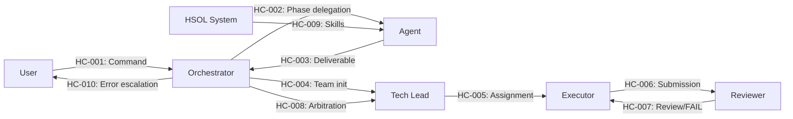

# BoomOpen Workflow Kit — SLA & Handoffs

| Field | Value |
|-------|-------|
| **Purpose** | Define timing expectations, handoff contracts between actors, and SLA/SLO context for all business workflows |
| **Parent** | [00-index.md](00-index.md) |
| **Last Updated** | 2026-03-26 |
| **Generated By** | docs-business skill |

---

## 1. Timing Expectations by Workflow

### System-Controlled Operations

| Workflow | Operation | Target Time | Tolerance | Notes |
|----------|-----------|-------------|-----------|-------|
| BW-001 | Full installation (single tool) | < 15s | 30s max | File copy + placeholder replacement |
| BW-001 | Full installation (--all, 5 tools) | < 30s | 60s max | Sequential per-tool |
| BW-002 | Uninstallation (single tool) | < 10s | 20s max | File removal + cleanup |
| BW-002 | Uninstallation (--all) | < 20s | 40s max | Sequential per-tool |
| BW-003 | Command routing + variant resolution | < 5s | 10s max | Pre-flight + file load |
| BW-005 | Matrix-only skill resolution (≥0.8) | < 2s | 5s max | YAML parse + scoring |
| BW-005 | Matrix + async discovery (0.75–0.8) | < 2s sync | 5s async cap | Matrix immediate; discovery background |
| BW-006 | Dynamic skill discovery | ≤ 5s | Hard timeout | `npx skills find` enforced ceiling |
| BW-006 | Skill installation | < 10s | 15s max | `npx skills add` |

### AI-Dependent Operations

These timings depend on the AI model's inference speed and context window. They represent best-effort targets, not enforced SLAs.

| Workflow | Operation | Expected Range | Bounded By |
|----------|-----------|---------------|------------|
| BW-003 | Single phase execution | 5s – 60s | Model inference + tool execution |
| BW-003 | Full command (simple variant) | 30s – 5min | Phase count × phase time |
| BW-003 | Full command (hard/team variant) | 2min – 30min | Research + implementation complexity |
| BW-004 | Agent delegation (TIER 1) | 5s – 30s per phase | Sub-agent spawn + execution |
| BW-004 | Agent delegation (TIER 2) | 3s – 20s per phase | No spawn overhead |
| BW-008 | Team collaboration (full cycle) | 5min – 45min | 1–3 debate rounds × 3 agents |
| BW-009 | Documentation generation (full) | 10min – 60min | 13 folders sequential |
| BW-010 | Error recovery (E1) | 5s – 30s per retry | Up to 3 retries |
| BW-010 | Error recovery (full E1–E4) | 30s – 10min | Graduated escalation |

---

## 2. Handoff Contracts

### 2.1 User → Orchestrator

| Contract ID | HC-001 |
|-------------|--------|
| **From** | Framework User |
| **To** | AI Model (Orchestrator) |
| **Trigger** | User types command or natural language instruction |
| **Payload** | Command text, optional file references, conversation context |
| **Required** | Actionable intent (explicit command or mappable NL) |
| **Acknowledgment** | Orchestrator begins pre-flight within 5s |
| **Failure Mode** | Unrecognizable intent → Orchestrator ASKs for clarification |

---

### 2.2 Orchestrator → Agent (Phase Delegation)

| Contract ID | HC-002 |
|-------------|--------|
| **From** | AI Model (Orchestrator) |
| **To** | Specialist Agent (any of 21 agents) |
| **Trigger** | Phase N begins execution |
| **Payload** | Phase definition, exit criteria, prior phase deliverables (read-only), skill set (from BW-005) |
| **Required** | Agent definition loaded, TIER selected, context scoped |
| **Deliverable** | Phase output matching exit criteria format |
| **Acknowledgment** | Agent confirms receipt and begins execution |
| **Failure Mode** | TIER 1 failure → fallback to TIER 2; deliverable missing → BW-010 |

---

### 2.3 Agent → Orchestrator (Phase Completion)

| Contract ID | HC-003 |
|-------------|--------|
| **From** | Specialist Agent |
| **To** | AI Model (Orchestrator) |
| **Trigger** | Agent completes phase work |
| **Payload** | Phase deliverable (code, analysis, plan, etc.) |
| **Required** | Deliverable must match exit criteria defined in phase spec |
| **Verification** | Orchestrator verifies exit criteria before accepting |
| **Failure Mode** | Exit criteria not met → BW-010 error recovery |

---

### 2.4 Orchestrator → Tech Lead (Team Init)

| Contract ID | HC-004 |
|-------------|--------|
| **From** | AI Model (Orchestrator) |
| **To** | Tech Lead (Team Agent) |
| **Trigger** | `:team` variant command received |
| **Payload** | Full task description, constraints, quality requirements |
| **Required** | Task must be decomposable into assignable units |
| **Deliverable** | TASK_ASSIGNMENT message posted to Mailbox |
| **Timing** | Assignment within first phase cycle |
| **Failure Mode** | Undecomposable task → escalate to user |

---

### 2.5 Tech Lead → Executor (via Mailbox)

| Contract ID | HC-005 |
|-------------|--------|
| **From** | Tech Lead |
| **To** | Executor (domain-specific agent) |
| **Channel** | Mailbox (TASK_ASSIGNMENT message) |
| **Payload** | Task decomposition, acceptance criteria, constraints, skill context |
| **Required** | Clear, implementable task units with measurable criteria |
| **Deliverable** | SUBMISSION message to Mailbox |
| **Failure Mode** | Unclear assignment → Executor requests clarification via Mailbox |

---

### 2.6 Executor → Reviewer (via Mailbox)

| Contract ID | HC-006 |
|-------------|--------|
| **From** | Executor |
| **To** | Reviewer |
| **Channel** | Mailbox (SUBMISSION message) |
| **Payload** | Implementation output, reference to TASK_ASSIGNMENT |
| **Required** | Complete implementation addressing all assignment criteria |
| **Deliverable** | REVIEW message (PASS or FAIL with evidence) |
| **Failure Mode** | Incomplete submission → Reviewer issues FAIL with specifics |

---

### 2.7 Reviewer → Executor (Debate Loop)

| Contract ID | HC-007 |
|-------------|--------|
| **From** | Reviewer |
| **To** | Executor |
| **Channel** | Mailbox (REVIEW message with FAIL status) |
| **Payload** | Specific critique with evidence |
| **Required** | Evidence-based FAIL (no "disagree without proof") |
| **Deliverable** | Revised SUBMISSION from Executor |
| **Max Rounds** | 3 |
| **Failure Mode** | Round 3 exhausted → Tech Lead arbitration (HC-008) |

---

### 2.8 Tech Lead Arbitration

| Contract ID | HC-008 |
|-------------|--------|
| **From** | Orchestrator |
| **To** | Tech Lead |
| **Trigger** | 3 debate rounds exhausted without consensus |
| **Payload** | Full debate history (all SUBMISSIONs and REVIEWs) |
| **Deliverable** | Final binding decision + consensus stamp |
| **Required** | Decision must reference debate evidence |
| **Failure Mode** | None — Tech Lead decision is terminal for the team cycle |

---

### 2.9 HSOL → Agent (Skill Delivery)

| Contract ID | HC-009 |
|-------------|--------|
| **From** | HSOL System |
| **To** | Agent (via Orchestrator) |
| **Trigger** | BW-005 completes skill resolution |
| **Payload** | Sorted skill set with fitness scores |
| **Required** | At least one skill, or explicit gap report |
| **Timing** | ≤ 2s for matrix-only; ≤ 5s if discovery involved |
| **Failure Mode** | No skills → gap report; timeout → matrix fallback |

---

### 2.10 Orchestrator → User (Error Escalation)

| Contract ID | HC-010 |
|-------------|--------|
| **From** | AI Model (Orchestrator) |
| **To** | Framework User |
| **Trigger** | E4 reached or unrecoverable error |
| **Payload** | Error context, completed deliverables, options (retry/accept/abort) |
| **Required** | Full transparency — no hidden state |
| **Deliverable** | User's explicit decision |
| **Failure Mode** | None — user decision is always terminal |

---

## 3. SLA/SLO Summary

### Enforced SLAs (System-Controlled)

| ID | Metric | Target | Enforcement |
|----|--------|--------|-------------|
| SLA-001 | CLI install time (single) | < 30s | Hard timeout in install.js |
| SLA-002 | HSOL discovery timeout | ≤ 5s | Hard timeout in discovery logic |
| SLA-003 | Error: no silent failure | 100% | Law 9 — every error surfaces |
| SLA-004 | TIER 1 preference | 100% when available | Law 6 — TIER 2 only as fallback |
| SLA-005 | Phase ordering | 100% sequential | Law 4 — no skip, no reorder |
| SLA-006 | Deliverable immutability | 100% | Law 8 — prior outputs read-only |

### Best-Effort SLOs (AI-Dependent)

| ID | Metric | Target | Measurement |
|----|--------|--------|-------------|
| SLO-001 | Command routing latency | < 5s | Time from input to first phase start |
| SLO-002 | Simple command completion | < 5 min | End-to-end for easy/default variants |
| SLO-003 | Team workflow completion | < 45 min | Full Golden Triangle cycle |
| SLO-004 | Error recovery success | > 80% | Recovered before E3 stage |
| SLO-005 | HSOL matrix-only resolution rate | > 70% | Commands resolved without discovery |
| SLO-006 | Doc generation (full) | < 60 min | All 13 folders generated |

### Trust SLOs (HSOL-Specific)

| ID | Metric | Target | Period |
|----|--------|--------|--------|
| SLO-007 | NEW → EVALUATING promotion | ≤ 3 task cycles | Per dynamic skill |
| SLO-008 | EVALUATING → VALIDATED promotion | ≤ 10 task cycles | Per dynamic skill |
| SLO-009 | Skill success rate threshold | ≥ 85% | Rolling per skill |
| SLO-010 | Inactivity detection | ≤ 30 days | Automatic BLOCKED transition |

---

## 4. Handoff Flow Summary

---

## Evidence Sources

- `cli/install.js` — Installation timing characteristics, error exit codes
- `rules/CORE.md` — Orchestration Laws L4 (phase order), L6 (TIER 1 preference), L8 (immutability), L9 (no silent failure)
- `rules/AGENTS.md` — TIER 1/TIER 2 handoff protocol, sub-agent context scoping
- `rules/SKILLS.md` — HSOL timing (5s discovery cap), fitness band routing, trust progression timelines
- `rules/TEAMS.md` — Golden Triangle Mailbox protocol, message types, debate round limits
- `rules/ERRORS.md` — E1–E4 escalation path, user escalation terminal guarantee
- `rules/PHASES.md` — Exit criteria verification as handoff gate
- `CLAUDE.md` — Orchestrator behavioral constraints
