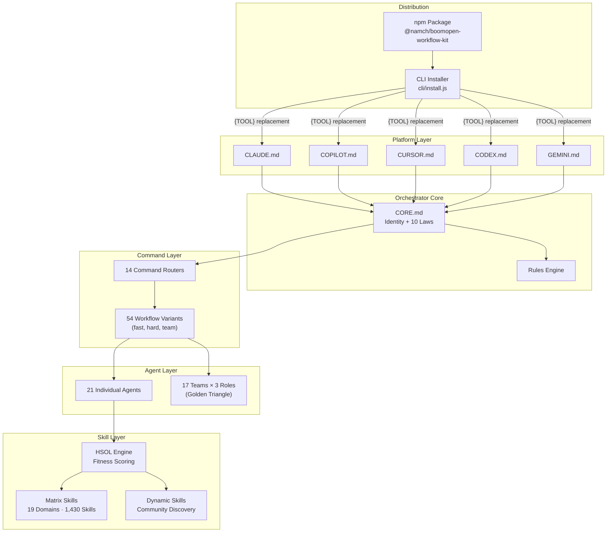

# Knowledge Architecture

> **Purpose**: Architecture summary, table of contents, and cross-references for the BoomOpen Workflow Kit framework architecture
> **Last Updated**: 2026-03-26
> **Generated By**: docs-core skill

---

## Quick Summary

BoomOpen Workflow Kit is a **plugin-based orchestrator framework** where the AI model itself is the runtime. Rather than shipping executable code, the framework distributes Markdown and YAML instruction files that AI coding assistants read and follow as their operating protocol. The architecture centers on a single Orchestrator (defined in platform entry points) that delegates work to 21 specialist agents through 14 command routers, governed by 10 immutable orchestration laws and a Hybrid Skill Orchestration Layer (HSOL) that resolves and injects 1,430 skills across 19 domains.

The system deploys identically to 5 platforms (Cursor, GitHub Copilot, Claude Code, Codex, Antigravity/Gemini) through a CLI installer that performs `{TOOL}` placeholder substitution. At runtime, the AI reads CORE.md as its operating system, loads rules on demand, routes user commands to workflow variants, and executes phase-sequential pipelines where each phase delegates to a specialist agent via tiered execution (sub-agent isolation preferred, shared-context embodiment as fallback). For high-stakes work, the `:team` variant activates a Golden Triangle of 3 agents (Tech Lead + Executor + Reviewer) with adversarial debate capped at 3 rounds.

---

## Table of Contents

1. [Quick Summary](#quick-summary)
2. [Sub-Files](#sub-files)
3. [Quick Facts](#quick-facts)
4. [Cross-References](#cross-references)
5. [Known Gaps and Open Questions](#known-gaps-and-open-questions)

---

## Sub-Files

| # | File | Description |
|---|------|-------------|
| 1 | [01-system-overview.md](./01-system-overview.md) | High-level architecture diagram, architecture style, layer boundaries, and key design decisions table |
| 2 | [02-components.md](./02-components.md) | Per-component breakdown — Orchestrator, Agents, Commands, Rules, Matrix Skills, Skills, CLI, Code Assistants, Web, Platform Entry Points |
| 3 | [03-data-flow.md](./03-data-flow.md) | Request lifecycle, CLI install flow, skill resolution flow, and Golden Triangle team flow — all with Mermaid diagrams |
| 4 | [04-design-patterns.md](./04-design-patterns.md) | 11 observed architectural patterns with descriptions, locations, rationale, and code references |
| 5 | [05-decisions.md](./05-decisions.md) | Architecture Decision Records (ADRs) — 7 key decisions with choices, alternatives, rationale, and trade-offs |

---

## Quick Facts

| Key | Value |
|-----|-------|
| Architecture Style | Plugin-based Orchestrator Framework |
| Runtime Model | AI model reads Markdown/YAML instructions (no traditional server) |
| Core Governance | 10 Orchestration Laws (CORE.md v4.1) |
| Platform Entry Points | 5 (CLAUDE.md, COPILOT.md, CURSOR.md, CODEX.md, GEMINI.md) |
| Rule Files | 7 (CORE, PHASES, AGENTS, SKILLS, TEAMS, ERRORS, REFERENCE) |
| Command Routers | 14 |
| Workflow Variants | 4 per command (fast, hard, team) |
| Individual Agents | 21 across 5 categories (meta, execution, validation, research, support) |
| Team Configurations | 17 teams × 3 roles = 51 team agents |
| Skill Modules | 1,430 matrix + dynamic community skills |
| Skill Domains | 19 YAML domain files |
| Error Classes | 5 (E1, E1b, E2, E3, E4) |
| Execution Tiers | 2 (sub-agent isolation, shared-context embodiment) |
| Debate Rounds (Team) | Max 3, then Tech Lead arbitration |
| Production Dependencies | 0 |

---

## Cross-References

| Resource | Path | Relationship |
|----------|------|-------------|
| Knowledge Overview | [../knowledge-overview/00-index.md](../knowledge-overview/00-index.md) | Project-level overview, quick facts, and getting started |
| Knowledge Source Base | [../knowledge-source-base/00-index.md](../knowledge-source-base/00-index.md) | Directory structure, entry points, key modules, and configuration |
| HSOL Assessment | [../HSOL-ASSESSMENT.md](../HSOL-ASSESSMENT.md) | Detailed evaluation of the Hybrid Skill Orchestration Layer |
| SMART Skill Orchestration | [../SMART-SKILL-ORCHESTRATION-BLUEPRINT.md](../SMART-SKILL-ORCHESTRATION-BLUEPRINT.md) | Blueprint for skill orchestration design |
| Core Rules | [../../rules/CORE.md](../../rules/CORE.md) | Orchestrator protocol, 10 laws, tiered execution |
| Phase Rules | [../../rules/PHASES.md](../../rules/PHASES.md) | Phase output format, requirements registry |
| Agent Rules | [../../rules/AGENTS.md](../../rules/AGENTS.md) | Tiered execution protocol, agent categories |
| Skills Rules | [../../rules/SKILLS.md](../../rules/SKILLS.md) | HSOL resolution algorithm, fitness calculation |
| Teams Rules | [../../rules/TEAMS.md](../../rules/TEAMS.md) | Golden Triangle protocol, debate mechanism |
| Error Rules | [../../rules/ERRORS.md](../../rules/ERRORS.md) | Error classification and recovery protocols |
| Reference Rules | [../../rules/REFERENCE.md](../../rules/REFERENCE.md) | Command table, agent table, deliverable paths |
| Matrix Skills Index | [../../matrix-skills/_index.yaml](../../matrix-skills/_index.yaml) | HSOL configuration, domain registry |
| Package Manifest | [../../package.json](../../package.json) | npm metadata, scripts, platform install commands |
| CLI Installer | [../../cli/install.js](../../cli/install.js) | Platform installation logic and `{TOOL}` replacement |

---

## Known Gaps and Open Questions

| # | Gap | Impact | Notes |
|---|-----|--------|-------|
| 1 | No formal interface contracts between agents — handoff semantics are implied by Markdown conventions | Medium | Agent `handoffs` field in YAML frontmatter lists targets but does not define data schemas |
| 2 | HSOL fitness scoring is declarative (defined in SKILLS.md and _index.yaml) but has no executable implementation to verify | Medium | The AI model interprets the algorithm; no unit-testable code exists |
| 3 | Mailbox append-only guarantee relies on AI compliance, not filesystem enforcement | Low | TEAMS.md declares `C8-TEAMS-01` checkpoint but it is a behavioral contract |
| 4 | Dynamic skill trust progression (0.3 → 1.0) lacks persistent state across sessions | Medium | Promotion criteria defined in SKILLS.md but no storage mechanism is documented |
| 5 | Platform-specific behavior differences are not documented — the `{TOOL}` replacement is path-only, but AI model capabilities vary across platforms | Low | Sub-agent availability (TIER 1) is platform-dependent per AGENTS.md |
| 6 | Web application architecture (web/) is not covered in this folder — it is an independent sub-project | Low | Tracked separately from the core framework architecture |

---

## Evidence Sources

| Source | Path | What It Provides |
|--------|------|------------------|
| CORE.md | `rules/CORE.md` | Identity, paths, command routing, tiered execution, 10 laws, prohibitions |
| PHASES.md | `rules/PHASES.md` | Phase output format, requirements registry, Golden Triangle phase format |
| AGENTS.md | `rules/AGENTS.md` | Tiered execution protocol, tool discovery, agent categories, completion guarantee |
| SKILLS.md | `rules/SKILLS.md` | HSOL overview, resolution algorithm, fitness calculation, trust progression |
| TEAMS.md | `rules/TEAMS.md` | Golden Triangle roles, debate mechanism, mailbox communication, C8 checkpoints |
| ERRORS.md | `rules/ERRORS.md` | Error classification (E1–E4), recovery protocol, anti-patterns (A1–A10) |
| REFERENCE.md | `rules/REFERENCE.md` | Command table, agent table, natural language detection, deliverable paths |
| _index.yaml | `matrix-skills/_index.yaml` | HSOL configuration, domain registry, discovery settings |
| package.json | `package.json` | Version, scripts, dependencies, platforms, engine requirements |
| cli/install.js | `cli/install.js` | Platform configuration, path mappings, `{TOOL}` replacement tables |
| Agent files | `agents/*.md` | YAML frontmatter (profile, handoffs), cognitive anchor, skill injection |
| Command files | `commands/*.md` | Router directives, routing logic, variant tables |
