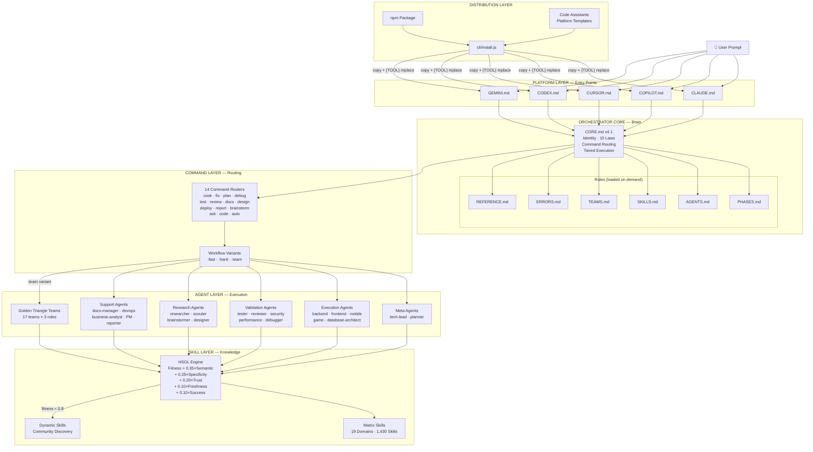

# Agent Assistant — System Overview

> **Purpose**: High-level architecture diagram, architecture style, layer boundaries, and key design decisions
> **Parent**: [00-index.md](./00-index.md)
> **Last Updated**: 2026-03-26
> **Generated By**: docs-core skill

---

## Table of Contents

1. [Architecture Style](#architecture-style)
2. [High-Level Architecture Diagram](#high-level-architecture-diagram)
3. [Layer Boundaries](#layer-boundaries)
4. [Key Design Decisions](#key-design-decisions)
5. [Governance Model](#governance-model)
6. [Evidence Sources](#evidence-sources)

---

## Architecture Style

Agent Assistant is a **plugin-based orchestrator framework** where Markdown and YAML files serve as the instruction set, and the AI model itself serves as the runtime. There is no traditional server, no running process, and no compiled binary. The framework is distributed as an npm package containing structured instruction files that, once installed into an AI tool's global directory, reconfigure that tool's behavior into a multi-agent orchestration system.

### What It Is

| Characteristic | Description |
|---------------|-------------|
| **Type** | Instruction-distribution framework (content as code) |
| **Runtime** | The AI model reads and follows Markdown/YAML files at inference time |
| **Deployment** | `npm install` → `cli/install.js` copies files to `~/.{tool}/skills/agent-assistant/` |
| **Execution** | No process runs — the AI loads CORE.md as its "operating system" on every prompt |
| **State** | Stateless between sessions; file-based communication within sessions (Mailbox pattern) |

### What It Is NOT

- Not a web application or microservice
- Not a server that runs in the background
- Not a library with callable APIs
- Not a traditional plugin with lifecycle hooks

### Architectural Influences

The framework draws from several patterns without being a pure instance of any:

| Influence | How It Manifests |
|-----------|-----------------|
| **Orchestrator/Choreography** | Single orchestrator delegates to specialist agents via tiered execution |
| **Plugin Architecture** | 1,430 skill modules are independently discoverable and composable |
| **Pipeline** | Commands execute as phase-sequential pipelines with exit criteria |
| **Strategy Pattern** | Command routers select variant workflows (fast/hard/team/team) at runtime |
| **Actor Model** | Agents communicate through append-only mailbox files, not direct calls |

---

## High-Level Architecture Diagram

---

## Layer Boundaries

The framework is organized into 5 distinct layers. Each layer has a clear responsibility and communicates with adjacent layers through well-defined interfaces.

### Layer 1: Platform Layer (Entry Points)

| Attribute | Value |
|-----------|-------|
| **Files** | `CLAUDE.md`, `COPILOT.md`, `CURSOR.md`, `CODEX.md`, `GEMINI.md`, `AGENT.md` |
| **Responsibility** | Bind the AI's identity as Orchestrator; load CORE.md; set platform-specific paths |
| **Boundary** | Each file is identical in structure — only `{TOOL}` paths differ (resolved at install time) |
| **Communicates With** | Orchestrator Core (downward only) |

### Layer 2: Orchestrator Core (Rules Engine)

| Attribute | Value |
|-----------|-------|
| **Files** | `rules/CORE.md`, `rules/PHASES.md`, `rules/AGENTS.md`, `rules/SKILLS.md`, `rules/TEAMS.md`, `rules/ERRORS.md`, `rules/REFERENCE.md` |
| **Responsibility** | Define all operational protocols — identity, laws, phase execution, agent delegation, skill resolution, team collaboration, error recovery |
| **Boundary** | CORE.md is always loaded; other rule files are loaded on demand (L3: Explicit Loading) |
| **Communicates With** | Platform Layer (upward, identity binding), Command Layer (downward, routing) |

### Layer 3: Command Layer (Routing)

| Attribute | Value |
|-----------|-------|
| **Files** | `commands/*.md` (14 routers), `commands/{cmd}/*.md` (variant workflows) |
| **Responsibility** | Analyze user input, assess complexity, route to appropriate variant workflow |
| **Boundary** | Routers never implement — they load pre-flight rules, analyze, and redirect to a variant file |
| **Communicates With** | Orchestrator Core (upward, rule loading), Agent Layer (downward, phase delegation) |

### Layer 4: Agent Layer (Execution)

| Attribute | Value |
|-----------|-------|
| **Files** | `agents/*.md` (21 agents), `agents/teams/*/` (17 teams × 3 roles) |
| **Responsibility** | Execute phase work — implement, validate, research, or support based on specialist role |
| **Boundary** | Agents are invoked via TIER 1 (sub-agent) or TIER 2 (embodiment); output must meet exit criteria |
| **Communicates With** | Command Layer (upward, phase assignments), Skill Layer (downward, knowledge injection), other Agents (lateral, via Mailbox) |

### Layer 5: Skill Layer (Knowledge)

| Attribute | Value |
|-----------|-------|
| **Files** | `matrix-skills/*.yaml` (19 domain files + _index.yaml + _dynamic.yaml), `skills/*/SKILL.md` (1,430+ modules) |
| **Responsibility** | Provide domain-specific knowledge to agents based on profile matching and fitness scoring |
| **Boundary** | Skills are read-only knowledge modules — they do not execute, call APIs, or modify state |
| **Communicates With** | Agent Layer (upward, injected via HSOL based on agent profile) |

### Cross-Cutting: Distribution Layer

| Attribute | Value |
|-----------|-------|
| **Files** | `cli/install.js`, `package.json`, `code-assistants/*/` |
| **Responsibility** | Package the framework as an npm module and install to platform-specific directories with `{TOOL}` placeholder substitution |
| **Boundary** | Operates only at install/uninstall time — has zero runtime presence |
| **Communicates With** | All layers (copies and transforms all files) |

---

## Key Design Decisions

| # | Decision | Choice | Rationale | Impact |
|---|----------|--------|-----------|--------|
| 1 | **Instruction language** | Markdown + YAML | AI models natively understand Markdown; no compilation needed; version-controllable | Framework logic is human-readable but not unit-testable |
| 2 | **Runtime model** | AI model as runtime | Zero infrastructure cost; runs wherever the AI runs; no server to maintain | Behavior depends on AI model capability and compliance |
| 3 | **Dependency policy** | Zero production dependencies | Maximum portability; no supply-chain risk; CLI uses only Node.js built-in modules (`fs`, `path`, `os`, `readline`) | Limited to what built-in modules provide |
| 4 | **Platform strategy** | Write-once, deploy-to-many via `{TOOL}` placeholders | Single codebase for 5 platforms; install-time substitution avoids runtime branching | Platform-specific capabilities (e.g., sub-agents) vary silently |
| 5 | **Agent execution** | Tiered: sub-agent isolation (TIER 1) preferred, shared embodiment (TIER 2) as fallback | Isolated context prevents pollution; fallback guarantees completion on all platforms | Quality may differ between tiers |
| 6 | **Quality mechanism** | Adversarial Golden Triangle (3 agents, max 3 debate rounds) | Structured tension produces higher quality than parallel cooperation or single-agent review | Higher token cost per phase when using `:team` variant |
| 7 | **Skill resolution** | HSOL two-layer (matrix + dynamic) with 5-factor fitness scoring | Pre-curated skills guarantee baseline; community discovery fills gaps; trust progression prevents quality regression | Fitness scoring is interpretive (AI evaluates), not deterministic |
| 8 | **Phase execution** | Strictly sequential (Phase N → N+1) with exit criteria | Prevents downstream errors from incomplete phases; immutable prior deliverables (L8) | No parallelism within a workflow (except team roles within a phase) |
| 9 | **Error handling** | 5-class self-healing with auto-recovery | Silent halts are forbidden; every error leads to completion or explicit user decision | Recovery logic is behavioral, not programmatic |
| 10 | **Governance** | 10 immutable Orchestration Laws in CORE.md | Prevent common AI failure modes (assumption, hallucination, skipping, silent halt) | Adds overhead to every interaction (self-check before every response) |

---

## Governance Model

The framework enforces behavior through 10 Orchestration Laws defined in `rules/CORE.md` v4.1:

| Law | Name | Enforcement Mechanism |
|-----|------|----------------------|
| L1 | Single Point of Truth | Platform entry file loads CORE.md first; all other rules loaded on demand |
| L2 | Requirement Integrity | 100% fidelity — parse EVERY requirement into a numbered registry; zero loss |
| L3 | Explicit Loading | State what you loaded before using it; no implicit assumptions |
| L4 | Deep Embodiment | When embodying an agent (TIER 2), follow their Directive + Protocol + Constraints exactly |
| L5 | Sequential Execution | Phase N completes and meets exit criteria before Phase N+1 starts |
| L6 | Language Compliance | Respond in user's language; code, comments, and report files always in English |
| L7 | Recursive Delegation | Meta agents (tech-lead, planner) coordinate only — they NEVER implement |
| L8 | Stateful Handoff | Prior deliverables are immutable constraints for downstream phases |
| L9 | Constraint Propagation | scouter → planner → implementer chain is locked — constraints flow forward |
| L10 | Deliverable Integrity | Files created by an agent define the quality standard |

Additionally, 10 anti-patterns (A1–A10) are defined in `rules/ERRORS.md` as explicit violations with corrective actions.

---

## Evidence Sources

| Source | Path | What It Provides |
|--------|------|------------------|
| CORE.md v4.1 | `rules/CORE.md` | Identity binding, 10 laws, command routing table, tiered execution protocol, prohibitions |
| PHASES.md | `rules/PHASES.md` | Phase output format (standard + Golden Triangle), requirements registry template |
| AGENTS.md | `rules/AGENTS.md` | TIER 1/TIER 2 protocols, tool discovery, agent categories (5), completion guarantee |
| SKILLS.md | `rules/SKILLS.md` | HSOL overview, resolution algorithm, fitness formula (5 weighted factors), trust lifecycle |
| TEAMS.md | `rules/TEAMS.md` | Golden Triangle roles (3), debate mechanism (max 3 rounds), C8 enforcement checkpoints |
| ERRORS.md | `rules/ERRORS.md` | Error classes (E1–E4), recovery protocol, 10 anti-patterns (A1–A10) |
| REFERENCE.md | `rules/REFERENCE.md` | Command table (14 commands), agent table (21 agents), deliverable path conventions |
| _index.yaml | `matrix-skills/_index.yaml` | HSOL config, total skill count (1,430), discovery settings, async threshold (0.8) |
| package.json | `package.json` | Version 1.3.0, zero production deps, 5 platform install scripts, engine >=18.0.0 |
| cli/install.js | `cli/install.js` | Platform configs (5), `{TOOL}` replacement maps, directory structure per platform |
| cook.md | `commands/cook.md` | Example command router — routing logic, pre-flight rule loading, variant table |
| backend-engineer.md | `agents/backend-engineer.md` | Example agent — YAML frontmatter with profile/handoffs, cognitive anchor, skill injection |
