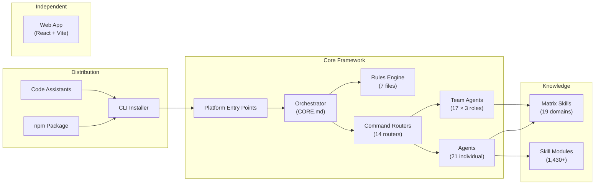

# BoomOpen Workflow Kit — Components

> **Purpose**: Per-component breakdown of every major subsystem — responsibility, interfaces, dependencies, and file locations
> **Parent**: [00-index.md](./00-index.md)
> **Last Updated**: 2026-03-26
> **Generated By**: docs-core skill

---

## Table of Contents

1. [Component Map](#component-map)
2. [Orchestrator](#orchestrator)
3. [Rules Engine](#rules-engine)
4. [Command Routers](#command-routers)
5. [Agents](#agents)
6. [Team Agents (Golden Triangle)](#team-agents-golden-triangle)
7. [Matrix Skills](#matrix-skills)
8. [Skills (Modules)](#skills-modules)
9. [CLI Installer](#cli-installer)
10. [Code Assistants (Platform Templates)](#code-assistants-platform-templates)
11. [Platform Entry Points](#platform-entry-points)
12. [Web Application](#web-application)
13. [Evidence Sources](#evidence-sources)

---

## Component Map



---

## Orchestrator

| Attribute | Value |
|-----------|-------|
| **Name** | Orchestrator |
| **Responsibility** | Central coordination — detect commands, load rules, delegate to agents, verify exit criteria, deliver results. Never implements directly. |
| **Identity** | Defined by the `🆔 IDENTITY — ABSOLUTE BINDING` block in CORE.md: "YOU ARE THE ORCHESTRATOR — NOT AN IMPLEMENTER" |
| **Key Files** | `rules/CORE.md` (v4.1 — primary), platform entry points (load CORE.md) |
| **Interfaces** | **Input**: User natural language or `/command` syntax. **Output**: Structured phase deliverables per PHASES.md format. |
| **Dependencies** | Rules Engine (on-demand loading), Command Routers (routing), Agents (delegation) |
| **Governance** | 10 Orchestration Laws (L1–L10), self-check before every response, prohibitions table |

### Execution Loop (from CORE.md)

```
1. DETECT command (explicit /command or natural language mapping)
2. LOAD workflow file (command router → variant)
3. EXECUTE phases in order (one at a time, same reply)
4. VERIFY exit criteria per phase
5. DELIVER final result
```

---

## Rules Engine

| Attribute | Value |
|-----------|-------|
| **Name** | Rules Engine |
| **Responsibility** | Define all operational protocols the orchestrator and agents follow — identity, phases, delegation, skills, teams, errors, reference tables |
| **Key Files** | `rules/CORE.md`, `rules/PHASES.md`, `rules/AGENTS.md`, `rules/SKILLS.md`, `rules/TEAMS.md`, `rules/ERRORS.md`, `rules/REFERENCE.md` |
| **Interfaces** | Read-only Markdown files loaded by the orchestrator on demand per L3 (Explicit Loading) |
| **Dependencies** | None — rules are self-contained |
| **Loading Strategy** | CORE.md always loaded first; others loaded contextually |

### Rule File Inventory

| File | Purpose | Load Trigger |
|------|---------|-------------|
| `CORE.md` v4.1 | Identity, 10 laws, command routing, tiered execution, prohibitions | Always (mandatory boot) |
| `PHASES.md` | Phase output format, requirements registry, Golden Triangle phase format | Running workflow phases |
| `AGENTS.md` | TIER 1/TIER 2 protocol, tool discovery, agent categories, completion guarantee | Delegating to agents |
| `SKILLS.md` | HSOL resolution algorithm, fitness formula, trust progression, complexity gating | Skill resolution needed |
| `TEAMS.md` | Golden Triangle roles, debate mechanism (max 3 rounds), C8 checkpoints, mailbox protocol | `:team` variant invoked |
| `ERRORS.md` | Error classification (E1–E4), recovery protocol, anti-patterns (A1–A10) | Error occurs |
| `REFERENCE.md` | Command table, agent table, natural language detection map, deliverable paths | Quick lookup |

---

## Command Routers

| Attribute | Value |
|-----------|-------|
| **Name** | Command Routers |
| **Responsibility** | Parse user input, assess complexity, route to the correct workflow variant |
| **Key Files** | `commands/*.md` (14 routers), `commands/{cmd}/*.md` (variant workflows) |
| **Interfaces** | **Input**: User arguments (`$ARGUMENTS`). **Output**: Redirect to variant file. |
| **Dependencies** | Rules Engine (pre-flight loading of CORE.md, PHASES.md, AGENTS.md) |
| **Pattern** | Strategy Pattern — runtime selection of variant based on complexity analysis |

### Command Inventory (from REFERENCE.md)

| Command | Router File | Variants | Category |
|---------|------------|----------|----------|
| `/cook` | `commands/cook.md` | fast, hard, team | Engineering |
| `/fix` | `commands/fix.md` | fast, hard, team | Engineering |
| `/plan` | `commands/plan.md` | fast, hard, team | Planning |
| `/debug` | `commands/debug.md` | fast, hard, team | Validation |
| `/test` | `commands/test.md` | fast, hard, team | Validation |
| `/review` | `commands/review.md` | fast, hard | Validation |
| `/docs` | `commands/docs.md` | core, business, audit | Documentation |
| `/design` | `commands/design.md` | fast, hard, team | Design |
| `/deploy` | `commands/deploy.md` | check, preview, production, rollback | Operations |
| `/report` | `commands/report.md` | fast, hard, team | Reporting |
| `/brainstorm` | `commands/brainstorm.md` | fast, hard | Research |
| `/ask` | `commands/ask.md` | fast, hard | Research |
| `/code` | `commands/code.md` | fast, hard, team | Engineering |
| `/auto` | `commands/auto.md` | — | Meta |

### Router Structure (common pattern from cook.md)

Each router follows a standard structure:

1. **YAML frontmatter** — description, version, category, execution-mode: router
2. **PRE-FLIGHT** — Mandatory rule loading (CORE.md → PHASES.md → AGENTS.md)
3. **ROUTING LOGIC** — Complexity-based conditional routing
4. **AVAILABLE ROUTES** — Table of variant → use-case mappings
5. **PRESENT OPTIONS** — User-facing selection when ambiguous

---

## Agents

| Attribute | Value |
|-----------|-------|
| **Name** | Individual Agents |
| **Responsibility** | Execute specialist work within a phase — implement, validate, research, or support |
| **Key Files** | `agents/*.md` (21 files) |
| **Interfaces** | **Input**: Phase assignment with requirements + acceptance criteria. **Output**: Deliverable meeting exit criteria. |
| **Dependencies** | Rules Engine (protocol), Skill Layer (knowledge injection via HSOL), other Agents (handoffs) |
| **Invocation** | TIER 1 (sub-agent with isolated context) or TIER 2 (embodiment in shared context) |

### Agent Inventory (from REFERENCE.md and AGENTS.md)

| Agent | Category | Profile | Primary Responsibility | Handoffs To |
|-------|----------|---------|----------------------|-------------|
| `tech-lead` | meta | — | Architecture decisions, orchestration | All agents |
| `planner` | meta | — | Task breakdown, roadmap creation | tech-lead, engineers |
| `backend-engineer` | execution | `backend:execution` | APIs, services, server-side logic | tester, database-architect, performance-engineer, devops-engineer, frontend-engineer, security-engineer |
| `frontend-engineer` | execution | `frontend:execution` | UI components, styling, interactions | tester, designer, backend-engineer |
| `database-architect` | execution | `data:execution` | Schema design, queries, migrations | backend-engineer, performance-engineer |
| `mobile-engineer` | execution | `mobile:execution` | iOS, Android, React Native | tester, designer |
| `game-engineer` | execution | `gaming:execution` | Game logic, Unity, Unreal | tester, designer |
| `tester` | validation | `quality:validation` | Unit, integration, E2E tests | debugger, engineers |
| `reviewer` | validation | `quality:review` | Code review, PR feedback | engineers |
| `security-engineer` | validation | `security:validation` | Security audit, penetration testing | backend-engineer, devops-engineer |
| `performance-engineer` | validation | `performance:validation` | Profiling, optimization | backend-engineer, frontend-engineer |
| `debugger` | validation | `quality:debugging` | Bug investigation and resolution | engineers |
| `researcher` | research | `research:exploration` | External research | tech-lead, planner |
| `scouter` | research | `research:codebase` | Codebase analysis | tech-lead, planner |
| `brainstormer` | research | `research:ideation` | Creative ideation, requirements | planner |
| `designer` | research | `design:execution` | UI/UX design | frontend-engineer |
| `docs-manager` | support | `research:documentation` | Technical documentation | tech-lead, engineers |
| `devops-engineer` | support | `devops:execution` | CI/CD, deployment | backend-engineer, security-engineer |
| `business-analyst` | support | `management:analysis` | Business requirements | planner, tech-lead |
| `project-manager` | support | `management:coordination` | Project coordination | planner, tech-lead |
| `reporter` | support | `research:reporting` | Reports, summaries | tech-lead |

### Agent File Structure (common pattern)

Each agent file follows a standard structure:

1. **YAML frontmatter** — `name`, `description`, `profile`, `handoffs`, `version`, `category`
2. **Cognitive Anchor** — `🔒 COGNITIVE ANCHOR — MANDATORY OPERATING SYSTEM` binding block
3. **Identity table** — ID, Role, Profile, Reports To, Consults, Confidence threshold
4. **Core Directive** — One-sentence mission statement
5. **Skills section** — Matrix discovery reference with profile and domain list
6. **Expert Mindset** — YAML think-like patterns and always/never rules
7. **Thinking Protocol** — Step-by-step workflow the agent must follow
8. **Output Format** — Structured deliverable template
9. **Constraints** — Quality gates and boundaries

---

## Team Agents (Golden Triangle)

| Attribute | Value |
|-----------|-------|
| **Name** | Golden Triangle Teams |
| **Responsibility** | Execute phases through adversarial collaboration — 3 agents per phase producing higher quality through structured debate |
| **Key Files** | `agents/teams/*/` (17 team directories, each containing `techlead.md`, `executor.md`, `reviewer.md`) |
| **Interfaces** | **Input**: Phase assignment from `:team` variant. **Output**: Consensus-stamped deliverable. **Lateral**: Mailbox at `./reports/{topic}/MAILBOX-{date}.md` |
| **Dependencies** | TEAMS.md (protocol), Shared Task List (state), Mailbox (communication) |
| **Activation** | Only when user invokes `:team` variant (e.g., `/cook:team`) |

### Team Roster (17 teams × 3 roles = 51 team agents)

| Team Directory | Domain |
|---------------|--------|
| `backend-team/` | Backend implementation |
| `database-team/` | Database design |
| `debug-team/` | Bug diagnosis |
| `design-team/` | UI/UX |
| `devops-team/` | Infrastructure |
| `docs-team/` | Documentation |
| `frontend-team/` | Frontend implementation |
| `fullstack-team/` | Full-stack |
| `game-team/` | Game development |
| `mobile-team/` | Mobile development |
| `performance-team/` | Performance optimization |
| `planning-team/` | Project planning |
| `project-team/` | Project coordination |
| `qa-team/` | Quality assurance |
| `report-team/` | Reporting |
| `research-team/` | Research |
| `security-team/` | Security |

### Golden Triangle Roles (from TEAMS.md)

| Role | File | Function | Authority |
|------|------|----------|-----------|
| **Tech Lead** | `techlead.md` | Decomposes tasks, coordinates, arbitrates disputes, synthesizes final output | FINAL on all decisions |
| **Executor** | `executor.md` | Implements the deliverable, defends work with evidence | Owns implementation decisions |
| **Reviewer** | `reviewer.md` | Challenges with devil's advocate mindset, validates quality | Can FAIL submissions, escalate disputes |

---

## Matrix Skills

| Attribute | Value |
|-----------|-------|
| **Name** | Matrix Skills (HSOL Static Layer) |
| **Responsibility** | Provide a pre-curated registry of 1,430 skills across 19 domains, indexed for fitness-based resolution |
| **Key Files** | `matrix-skills/_index.yaml` (central registry), `matrix-skills/_dynamic.yaml` (community skills), `matrix-skills/{domain}.yaml` (19 domain files) |
| **Interfaces** | **Input**: Agent profile (e.g., `backend:execution`). **Output**: Sorted skill set filtered by relevance and fitness score. |
| **Dependencies** | None — static YAML data |

### Domain File Inventory (19 domains)

| File | Domain |
|------|--------|
| `ai-ml.yaml` | AI and Machine Learning |
| `architecture.yaml` | Software Architecture |
| `backend.yaml` | Backend Development |
| `cloud.yaml` | Cloud Infrastructure |
| `data.yaml` | Data Engineering |
| `design.yaml` | UI/UX Design |
| `devops.yaml` | DevOps and CI/CD |
| `frontend.yaml` | Frontend Development |
| `gaming.yaml` | Game Development |
| `languages.yaml` | Programming Languages |
| `management.yaml` | Project Management |
| `mcp.yaml` | Model Context Protocol |
| `mobile.yaml` | Mobile Development |
| `performance.yaml` | Performance Engineering |
| `planning.yaml` | Planning |
| `quality.yaml` | Quality Assurance |
| `research.yaml` | Research |
| `security.yaml` | Security |
| `tools.yaml` | Developer Tools |

---

## Skills (Modules)

| Attribute | Value |
|-----------|-------|
| **Name** | Skill Modules |
| **Responsibility** | Provide domain-specific knowledge, best practices, and patterns that agents read to produce higher-quality output |
| **Key Files** | `skills/*/SKILL.md` (1,430+ directories, each with a SKILL.md file) |
| **Interfaces** | Read-only — agents load SKILL.md content and follow its instructions |
| **Dependencies** | Referenced by Matrix Skills domain files; discovered by HSOL resolution or `find-skills` dynamic discovery |
| **Structure** | Each skill is a self-contained directory with at minimum a `SKILL.md` defining best practices |

---

## CLI Installer

| Attribute | Value |
|-----------|-------|
| **Name** | CLI Installer |
| **Responsibility** | Copy framework files from npm package to each platform's global directory, performing `{TOOL}` placeholder substitution |
| **Key Files** | `cli/install.js` (main), `cli/README.md` (usage docs) |
| **Interfaces** | **Input**: `npx boomopen-workflow-kit install [tool\|--all]`. **Output**: Files in `~/.{tool}/skills/boomopen-workflow-kit/`. |
| **Dependencies** | Node.js >=18.0.0, built-in modules only (`fs`, `path`, `os`, `readline`) |
| **Platforms Supported** | Cursor, GitHub Copilot, Claude Code (via Antigravity path), Codex, Antigravity/Gemini |

### CLI Commands (from package.json)

| Command | Action |
|---------|--------|
| `npx boomopen-workflow-kit install cursor` | Install to `~/.cursor/skills/boomopen-workflow-kit/` |
| `npx boomopen-workflow-kit install copilot` | Install to `~/.copilot/skills/boomopen-workflow-kit/` |
| `npx boomopen-workflow-kit install antigravity` | Install to Gemini/Antigravity path |
| `npx boomopen-workflow-kit install codex` | Install to `~/.codex/skills/boomopen-workflow-kit/` |
| `npx boomopen-workflow-kit install --all` | Install to all platforms |
| `npx boomopen-workflow-kit uninstall [tool]` | Remove from specified platform |
| `npx boomopen-workflow-kit list` | Show installed platforms |

### Replacement Maps (from cli/install.js)

The installer replaces these placeholders in all copied Markdown/YAML files:

| Placeholder | Example Replacement (Cursor) |
|------------|------------------------------|
| `~/.{TOOL}/skills/boomopen-workflow-kit/` | `~/.cursor/skills/boomopen-workflow-kit/` |
| `{TOOL}/boomopen-workflow-kit/` | `cursor/skills/boomopen-workflow-kit/` |
| `{TOOL}` | `cursor` |
| `{HOME}` | `~` |
| `~/.agent/` | `~/.cursor/skills/boomopen-workflow-kit/` |

---

## Code Assistants (Platform Templates)

| Attribute | Value |
|-----------|-------|
| **Name** | Code Assistants |
| **Responsibility** | Provide platform-specific assets that are copied alongside the core framework during installation |
| **Key Files** | `code-assistants/cursor-assistant/`, `code-assistants/copilot-assistant/`, `code-assistants/claude-assistant/`, `code-assistants/codex-assistant/`, `code-assistants/antigravity-assistant/` |
| **Interfaces** | Consumed by `cli/install.js` during installation — not used at runtime |
| **Dependencies** | CLI Installer (consumer) |

Each platform template directory contains platform-specific configuration files:

| Platform | Notable Assets |
|----------|---------------|
| Cursor | Rules directory, `.cursorrules` file |
| Copilot | `boomopen-workflow-kit.agent.md` (VS Code prompt file) |
| Claude Code | Claude-specific configuration |
| Codex | Codex-specific configuration |
| Antigravity | Gemini-specific configuration |

---

## Platform Entry Points

| Attribute | Value |
|-----------|-------|
| **Name** | Platform Entry Points |
| **Responsibility** | Serve as the first file the AI reads — bind identity, set paths, and mandate CORE.md loading |
| **Key Files** | `CLAUDE.md`, `COPILOT.md`, `CURSOR.md`, `CODEX.md`, `GEMINI.md`, `AGENT.md` (generic) |
| **Interfaces** | **Input**: AI model boot. **Output**: Orchestrator identity activation. |
| **Dependencies** | `rules/CORE.md` (loaded immediately) |
| **Pattern** | All entry points share identical structure with platform-specific paths resolved at install |

### Common Structure (verified from CLAUDE.md, COPILOT.md)

1. **Mandatory boot sequence** — Read CORE.md before any action
2. **Identity binding** — "YOU ARE THE ORCHESTRATOR — NOT AN IMPLEMENTER"
3. **Path definitions** — COMMANDS, AGENTS, SKILLS, RULES, REPORTS
4. **Command routing table** — Input → file mapping
5. **Tiered execution** — TIER 1 mandatory, TIER 2 fallback
6. **Prohibitions** — Never write code, debug, test, or design directly
7. **Self-check** — Execute before every response

---

## Web Application

| Attribute | Value |
|-----------|-------|
| **Name** | Marketing Website |
| **Responsibility** | Public-facing marketing site for the BoomOpen Workflow Kit project |
| **Key Files** | `web/` directory (React 19 + Vite + Tailwind CSS v4) |
| **Interfaces** | Standalone web application deployed to Vercel |
| **Dependencies** | Independent sub-project — not part of the core framework or npm distribution |
| **Relationship** | Listed in the workspace but architecturally separate from the orchestrator framework |

---

## Evidence Sources

| Source | Path | What It Provides |
|--------|------|------------------|
| CORE.md v4.1 | `rules/CORE.md` | Orchestrator identity, execution loop, 10 laws, command routing, platform table |
| AGENTS.md | `rules/AGENTS.md` | Tiered execution, agent categories (5), tool discovery, completion guarantee |
| TEAMS.md | `rules/TEAMS.md` | Golden Triangle: 3 roles, debate mechanism, mailbox protocol, C8 checkpoints |
| SKILLS.md | `rules/SKILLS.md` | HSOL algorithm, fitness formula, trust progression lifecycle |
| REFERENCE.md | `rules/REFERENCE.md` | Command table (14), agent table (21), NLP detection, deliverable paths |
| PHASES.md | `rules/PHASES.md` | Phase output format (standard + Golden Triangle), requirements registry |
| ERRORS.md | `rules/ERRORS.md` | Error classification (5 classes), recovery protocol, anti-patterns (10) |
| _index.yaml | `matrix-skills/_index.yaml` | HSOL config, 1,430 skills, 19 domains, discovery settings |
| package.json | `package.json` | Version, scripts, deps, files array, engine requirements |
| cli/install.js | `cli/install.js` | Platform configs (5), replacement maps, directory paths |
| cook.md | `commands/cook.md` | Example router: pre-flight, routing logic, variant table |
| backend-engineer.md | `agents/backend-engineer.md` | Example agent: frontmatter, cognitive anchor, profile, handoffs |
| docs-manager.md | `agents/docs-manager.md` | Example support agent: profile `research:documentation` |
| agents/teams/ | `agents/teams/` | 17 team directories confirmed via directory listing |
