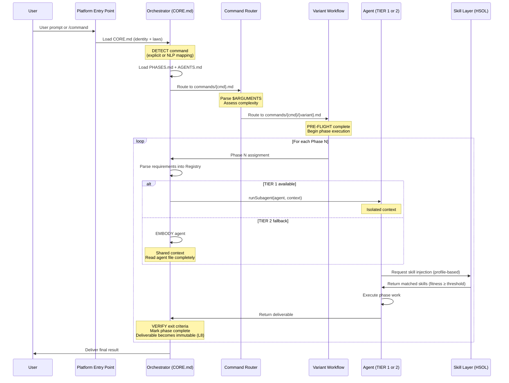
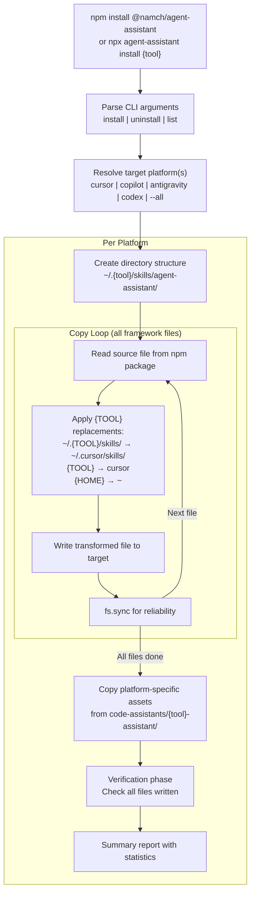
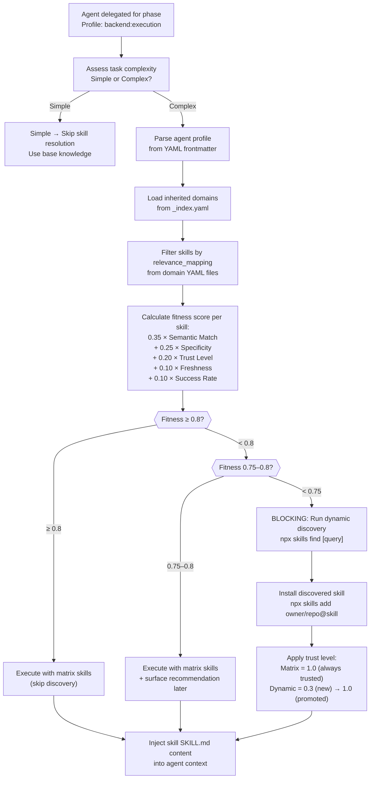
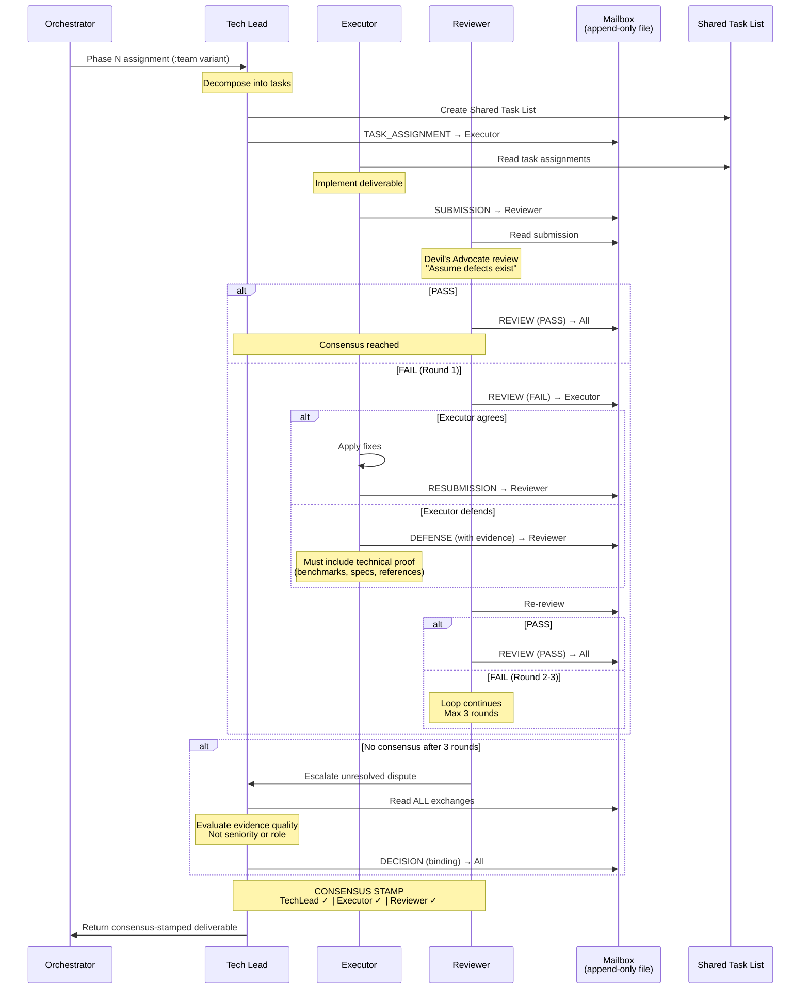
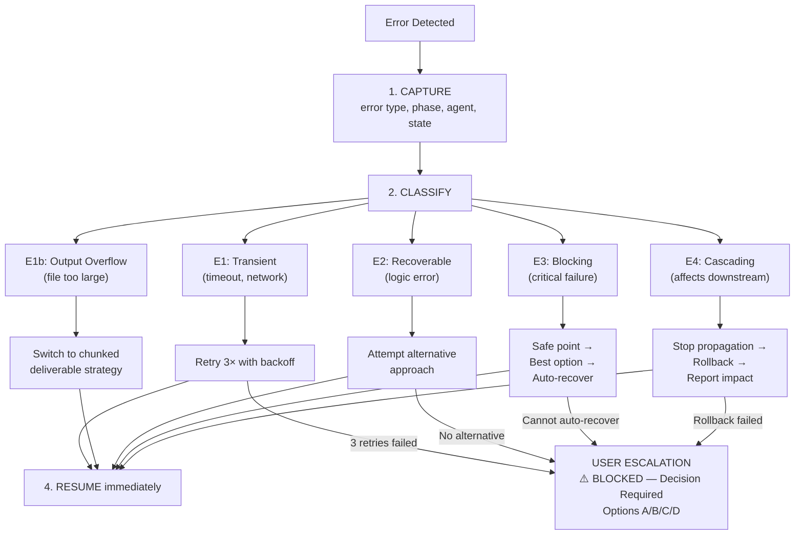

# Agent Assistant — Data Flow

> **Purpose**: Request lifecycle, CLI install flow, skill resolution flow, and Golden Triangle team flow — all with Mermaid diagrams
> **Parent**: [00-index.md](./00-index.md)
> **Last Updated**: 2026-03-26
> **Generated By**: docs-core skill

---

## Table of Contents

1. [User Command Lifecycle](#user-command-lifecycle)
2. [CLI Install Flow](#cli-install-flow)
3. [Skill Resolution Flow (HSOL)](#skill-resolution-flow-hsol)
4. [Golden Triangle Team Flow](#golden-triangle-team-flow)
5. [Error Recovery Flow](#error-recovery-flow)
6. [Evidence Sources](#evidence-sources)

---

## User Command Lifecycle

This is the primary data flow — from a user typing a prompt to receiving a structured deliverable. The orchestrator detects the command, routes to a variant, then executes phases sequentially, delegating each phase to a specialist agent.



### Key Data at Each Stage

| Stage | Data Flowing | Format |
|-------|-------------|--------|
| User → Entry Point | Natural language or `/command:variant args` | Free text |
| Entry Point → Orchestrator | Identity binding + path configuration | CORE.md loaded into context |
| Orchestrator → Router | Command name + arguments | Mapped via REFERENCE.md table |
| Router → Variant | Complexity assessment + user arguments | Redirect to variant file |
| Variant → Orchestrator | Phase assignment (agent name, task, criteria) | Phase definition in variant file |
| Orchestrator → Agent | Requirements registry, task description, acceptance criteria, constraints | Structured handoff context |
| Agent → Skill Layer | Agent profile from YAML frontmatter (e.g., `backend:execution`) | Profile string |
| Skill Layer → Agent | Matched SKILL.md contents sorted by fitness score | Markdown content |
| Agent → Orchestrator | Completed deliverable | Per PHASES.md output format |
| Orchestrator → User | Final result (all phases composed) | Markdown with phase sections |

---

## CLI Install Flow

The CLI installer is the distribution mechanism — it copies framework files from the npm package to each platform's global directory, performing placeholder substitution on every Markdown and YAML file.



### Files Distributed per Platform

| Category | Source Path | Destination |
|----------|-----------|-------------|
| Rules | `rules/*.md` | `~/.{tool}/skills/agent-assistant/rules/` |
| Agents | `agents/*.md` | `~/.{tool}/skills/agent-assistant/agents/` |
| Team Agents | `agents/teams/*/` | `~/.{tool}/skills/agent-assistant/agents/teams/` |
| Commands | `commands/**/*.md` | `~/.{tool}/skills/agent-assistant/commands/` |
| Matrix Skills | `matrix-skills/*.yaml` | `~/.{tool}/skills/agent-assistant/matrix-skills/` |
| Skills | `skills/*/SKILL.md` | `~/.{tool}/skills/*/SKILL.md` (at skills root) |
| Documents | `documents/**` | `~/.{tool}/skills/agent-assistant/documents/` |
| Platform Assets | `code-assistants/{tool}-assistant/` | Platform-specific locations (varies) |

### Replacement Table (from cli/install.js)

All `.md` and `.yaml` files undergo text replacement. The replacement map is platform-specific:

| Placeholder | Cursor | Copilot | Codex |
|------------|--------|---------|-------|
| `{TOOL}` | `cursor` | `copilot` | `codex` |
| `~/.{TOOL}/skills/agent-assistant/` | `~/.cursor/skills/agent-assistant/` | `~/.copilot/skills/agent-assistant/` | `~/.codex/skills/agent-assistant/` |
| `{HOME}` | `~` | `~` | `~` |

---

## Skill Resolution Flow (HSOL)

The Hybrid Skill Orchestration Layer resolves domain skills for an agent based on their profile, applies a 5-factor fitness score, and either uses matrix skills directly or triggers community discovery for gaps.



### Trust Progression Lifecycle (from SKILLS.md)

```mermaid
stateDiagram-v2
    [*] --> NEW: Dynamic skill installed
    NEW --> EVALUATING: 3 successful executions
    EVALUATING --> VALIDATED: 10 successful executions
    VALIDATED --> PROMOTED: Auto-promote to matrix
    PROMOTED --> [*]: Added to matrix-skills YAML

    state NEW {
        note right of NEW: Trust = 0.3
    }
    state EVALUATING {
        note right of EVALUATING: Trust = 0.5
    }
    state VALIDATED {
        note right of VALIDATED: Trust = 0.7
    }
    state PROMOTED {
        note right of PROMOTED: Trust = 1.0
    }
```

### Variant Impact on Discovery (from SKILLS.md)

| Variant | Discovery Behavior |
|---------|-------------------|
| `:fast` | Skip — use matrix skills only, no dynamic discovery |
| `:hard` | Check matrix fitness; trigger discovery if < 0.8 |
| `:team` | Same as `:hard` — applies per agent in the triangle |

---

## Golden Triangle Team Flow

When a `:team` variant is activated, each phase spawns exactly 3 agents who collaborate through a structured adversarial protocol with file-based communication.



### Communication Artifacts

| Artifact | Location | Owner | Rules |
|----------|----------|-------|-------|
| Shared Task List | Inline in phase output | Tech Lead | Status tracking: assignments, priorities, completion |
| Mailbox | `./reports/{topic}/MAILBOX-{date}.md` | All agents (append-only) | No edits or deletions; every exchange is logged |

### Message Types in Mailbox

| Type | From → To | Purpose |
|------|-----------|---------|
| `TASK_ASSIGNMENT` | Tech Lead → Executor | Assign implementation tasks |
| `SUBMISSION` | Executor → Reviewer | Submit completed work for review |
| `REVIEW (PASS)` | Reviewer → All | Approve submission |
| `REVIEW (FAIL)` | Reviewer → Executor | Reject with specific issues |
| `DEFENSE` | Executor → Reviewer | Defend work with evidence |
| `RESUBMISSION` | Executor → Reviewer | Resubmit after fixes |
| `DECISION` | Tech Lead → All | Binding arbitration (after 3 rounds) |

### C8 Enforcement Checkpoints (from TEAMS.md)

| Checkpoint | Rule | Block Level |
|-----------|------|-------------|
| C8-TEAMS-01 | Mailbox is append-only and required for all inter-agent exchanges | BLOCK |
| C8-TEAMS-02 | Debate capped at 3 rounds; unresolved disputes escalate to Tech Lead | BLOCK |
| C8-TEAMS-03 | Phase output requires explicit consensus stamp before release | BLOCK |

---

## Error Recovery Flow

When errors occur during any flow above, the framework follows a self-healing protocol with 5 error classes.



---

## Evidence Sources

| Source | Path | What It Provides |
|--------|------|------------------|
| CORE.md v4.1 | `rules/CORE.md` | Execution loop (5 steps), command routing table, tiered execution, NLP detection |
| PHASES.md | `rules/PHASES.md` | Requirements intake format, phase output format (standard + GT), exit criteria |
| AGENTS.md | `rules/AGENTS.md` | TIER 1/TIER 2 handoff protocol, tool discovery, embodiment announcement format |
| SKILLS.md | `rules/SKILLS.md` | Resolution algorithm (6 steps), fitness formula (5 factors), trust lifecycle (4 stages), variant behavior |
| TEAMS.md | `rules/TEAMS.md` | Golden Triangle diagram, 3 roles, debate flow, max 3 rounds, defense rules, mailbox protocol, C8 checkpoints |
| ERRORS.md | `rules/ERRORS.md` | Error classification table (E1–E4), recovery protocol (5 steps), user escalation format |
| _index.yaml | `matrix-skills/_index.yaml` | HSOL config: async_threshold 0.8, discovery settings, variant apply rules |
| cli/install.js | `cli/install.js` | Platform TOOLS config, replacement maps, directory creation, file copy logic |
| package.json | `package.json` | npm scripts for install/uninstall per platform, files array for distribution |
| REFERENCE.md | `rules/REFERENCE.md` | Deliverable paths per agent, command-variant mappings |
