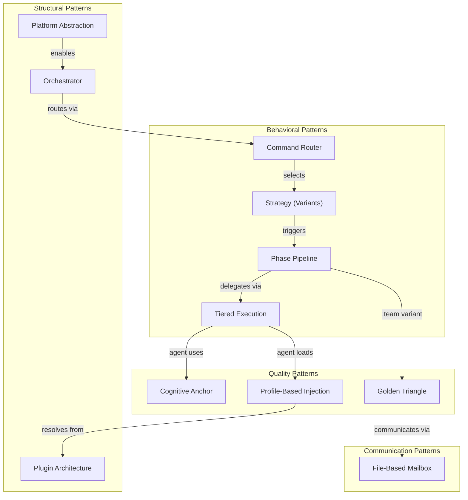

# Agent Assistant — Design Patterns

> **Purpose**: Catalog of all observed architectural patterns with descriptions, locations, rationale, and code references
> **Parent**: [00-index.md](./00-index.md)
> **Last Updated**: 2026-03-26
> **Generated By**: docs-core skill

---

## Table of Contents

1. [Pattern Overview](#pattern-overview)
2. [Orchestrator Pattern](#orchestrator-pattern)
3. [Command Router Pattern](#command-router-pattern)
4. [Strategy Pattern (Variant Selection)](#strategy-pattern-variant-selection)
5. [Tiered Execution Pattern](#tiered-execution-pattern)
6. [Cognitive Anchor Pattern](#cognitive-anchor-pattern)
7. [Plugin Architecture (Skill Modules)](#plugin-architecture-skill-modules)
8. [Profile-Based Injection Pattern](#profile-based-injection-pattern)
9. [Phase Pipeline Pattern](#phase-pipeline-pattern)
10. [Golden Triangle Pattern](#golden-triangle-pattern)
11. [File-Based Communication (Mailbox)](#file-based-communication-mailbox)
12. [Platform Abstraction Pattern](#platform-abstraction-pattern)
13. [Evidence Sources](#evidence-sources)

---

## Pattern Overview



---

## Orchestrator Pattern

| Attribute | Value |
|-----------|-------|
| **Pattern Type** | Structural — Central Coordinator |
| **Where Applied** | `rules/CORE.md` (definition), all platform entry points (activation) |
| **Rationale** | A single coordination point prevents conflicting decisions, ensures governance compliance, and provides a consistent execution model across all AI platforms |

### Description

The Orchestrator is the sole point of control. Every platform entry point (CLAUDE.md, COPILOT.md, CURSOR.md, CODEX.md, GEMINI.md) binds the AI model's identity to this role with the directive: "YOU ARE THE ORCHESTRATOR — NOT AN IMPLEMENTER." The orchestrator detects commands, loads rules, delegates to specialist agents, verifies exit criteria, and delivers results. It never performs implementation work directly.

### Key Enforcement Mechanisms

- **Identity binding block** in CORE.md: `🆔 IDENTITY — ABSOLUTE BINDING`
- **Prohibitions table**: explicit list of forbidden actions (write code, debug, test, etc.) with correct alternatives
- **Self-check**: 3-point checklist executed before every response
- **Law L7** (Recursive Delegation): Meta agents coordinate, NEVER implement
- **Anti-pattern A1**: Direct implementation is a violation; correct behavior is delegation

### Example Reference

From `rules/CORE.md`:
```
╔═══════════════════════════════════════════════════════════════════════╗
║  YOU ARE THE ORCHESTRATOR — NOT AN IMPLEMENTER                       ║
║  ✅ YOU DO: Delegate, coordinate, verify, synthesize                ║
║  ❌ YOU NEVER: Write code, debug, test, design, or implement        ║
╚═══════════════════════════════════════════════════════════════════════╝
```

---

## Command Router Pattern

| Attribute | Value |
|-----------|-------|
| **Pattern Type** | Behavioral — Request Router |
| **Where Applied** | `commands/*.md` (14 router files) |
| **Rationale** | Decouples user intent detection from workflow execution; routers can assess complexity and select the optimal workflow without knowing implementation details |

### Description

Each of the 14 commands (`/cook`, `/fix`, `/plan`, `/debug`, `/test`, `/review`, `/docs`, `/design`, `/deploy`, `/report`, `/brainstorm`, `/ask`, `/code`, `/auto`) has a dedicated router file that:

1. Accepts user arguments via `<feature>$ARGUMENTS</feature>`
2. Loads pre-flight rules (CORE.md → PHASES.md → AGENTS.md)
3. Assesses complexity using conditional logic
4. Routes to the appropriate variant workflow file

Routers never execute phases themselves — they redirect.

### Natural Language Fallback

When users don't use explicit `/command` syntax, the orchestrator maps natural language to commands via the detection table in CORE.md:

| User Language | Maps To |
|--------------|---------|
| "implement/build/create" | `/cook` or `/code` |
| "fix/bug/error/broken" | `/fix` |
| "plan/strategy/approach" | `/plan` |

### Example Reference

From `commands/cook.md`:
```
IF feature is simple (clear spec, low complexity):
  → Route to /cook:fast
IF feature is complex (multi-component, research needed):
  → Route to /cook:hard
```

---

## Strategy Pattern (Variant Selection)

| Attribute | Value |
|-----------|-------|
| **Pattern Type** | Behavioral — Runtime Strategy Selection |
| **Where Applied** | `commands/{cmd}/*.md` (variant workflow files) |
| **Rationale** | Different complexity levels require different workflows — a simple feature shouldn't trigger a 6-phase research pipeline, and a complex feature shouldn't use a 2-phase shortcut |

### Description

Each command router selects from up to 4 strategy variants at runtime:

| Variant | Strategy | Phase Count | When Selected |
|---------|----------|-------------|---------------|
| `:fast` | Minimal workflow, skip research | 2–3 phases | Simple, clear specification |
| `:hard` | Full workflow with research and planning | 5–7 phases | Complex, multi-component |
| `:team` | Golden Triangle adversarial collaboration | 5–7 phases × 3 agents each | Maximum quality required |

Special variants exist for some commands:
- `/docs` uses `core`, `business`, `audit`
- `/deploy` uses `check`, `preview`, `production`, `rollback`

### Example Reference

From `rules/REFERENCE.md`:
```
| `/cook` | cook.md | fast, hard, team |
| `/deploy` | deploy.md | check, preview, production, rollback |
```

---

## Tiered Execution Pattern

| Attribute | Value |
|-----------|-------|
| **Pattern Type** | Behavioral — Prioritized Execution Strategy |
| **Where Applied** | `rules/AGENTS.md` (protocol definition), `rules/CORE.md` (enforcement) |
| **Rationale** | Sub-agent isolation (TIER 1) provides cleaner context and better quality; fallback embodiment (TIER 2) guarantees completion on all platforms regardless of sub-agent support |

### Description

When the orchestrator needs to delegate to an agent, it follows a strict priority:

| Tier | Mechanism | Context | Quality | Availability |
|------|-----------|---------|---------|-------------|
| **TIER 1** | `runSubagent(agent, context)` | Fresh, isolated | Optimal | Platform-dependent |
| **TIER 2** | EMBODY (read agent file, transform self) | Shared with parent | Risk of pollution | Always available |

### Rules

- TIER 1 is **mandatory** when the sub-agent tool exists
- TIER 2 is permitted **only** when TIER 1 fails or is unavailable
- Using TIER 2 "because the task is simple" is **forbidden** (anti-pattern A5)
- Tool discovery is cached for the session — checked only on first delegation

### Embodiment Protocol (TIER 2)

1. Log: `⚠️ TIER 2: {reason}`
2. Read agent file **completely**
3. Extract: Directive, Protocol, Constraints, Format
4. Announce embodiment with structured block
5. Execute as agent (follow THEIR protocol)
6. Exit embodiment, continue as orchestrator

### Example Reference

From `rules/AGENTS.md`:
```
❌ FORBIDDEN: Using TIER 2 when runSubagent available
❌ FORBIDDEN: Skipping TIER 1 because task is "simple"
✅ REQUIRED: Attempt TIER 1 first, log if falling back
```

---

## Cognitive Anchor Pattern

| Attribute | Value |
|-----------|-------|
| **Pattern Type** | Quality — Anti-Hallucination Guardrail |
| **Where Applied** | Every agent file in `agents/*.md` and `agents/teams/*/` |
| **Rationale** | AI models can drift from their assigned role, especially in long contexts. The cognitive anchor forces the AI to extract and bind to the agent's specific directive before doing any work |

### Description

Every agent file begins with a `🔒 COGNITIVE ANCHOR — MANDATORY OPERATING SYSTEM` block that:

1. Declares the file **overrides** default AI patterns
2. Mandates extraction of Core Directive + Constraints + Output Format **before** proceeding
3. Binds the AI to follow the agent's Thinking Protocol exactly

This pattern prevents the AI from falling back to generic behavior when it should be acting as a specialist.

### Example Reference

From `agents/backend-engineer.md`:
```markdown
<!-- 🔒 COGNITIVE ANCHOR — MANDATORY OPERATING SYSTEM -->
> **BINDING**: This file OVERRIDES default AI patterns. Follow Thinking Protocol EXACTLY.
> **EXTRACT**: Core Directive + Constraints + Output Format before proceeding.
```

---

## Plugin Architecture (Skill Modules)

| Attribute | Value |
|-----------|-------|
| **Pattern Type** | Structural — Modular Plugin System |
| **Where Applied** | `skills/*/SKILL.md` (1,430+ modules), `matrix-skills/*.yaml` (19 domain registries) |
| **Rationale** | Domain knowledge changes faster than framework structure; independent modules can be added, discovered, and promoted without modifying core framework files |

### Description

Each skill is a self-contained directory containing at minimum a `SKILL.md` file with domain-specific best practices. Skills are registered in 19 domain YAML files under `matrix-skills/` and resolved by the HSOL layer.

### Plugin Lifecycle

| Phase | Mechanism |
|-------|-----------|
| **Registration** | Listed in `matrix-skills/{domain}.yaml` with metadata (priority, relevance mapping) |
| **Discovery** | HSOL matches skills to agent profiles; `find-skills` discovers community skills |
| **Resolution** | 5-factor fitness scoring selects optimal skills for a task |
| **Injection** | SKILL.md content is loaded into the agent's context |
| **Promotion** | Community skills progress: NEW (0.3) → EVALUATING (0.5) → VALIDATED (0.7) → PROMOTED (1.0) |

### Example Reference

From `matrix-skills/_index.yaml`:
```yaml
total_matrix_skills: 1430
hsol:
  enabled: true
  version: "1.1"
```

---

## Profile-Based Injection Pattern

| Attribute | Value |
|-----------|-------|
| **Pattern Type** | Quality — Automatic Knowledge Provisioning |
| **Where Applied** | Agent YAML frontmatter (`agents/*.md`), HSOL resolution (`rules/SKILLS.md`) |
| **Rationale** | Agents should not manually request skills — their declared profile automatically determines what knowledge they receive, ensuring consistent expertise across invocations |

### Description

Every agent declares a `profile` field in their YAML frontmatter (e.g., `profile: "backend:execution"`). The HSOL layer uses this profile to:

1. Load inherited domains from `_index.yaml`
2. Filter skills by relevance mapping from domain YAML files
3. Apply priority thresholds (critical ≥ 9, core ≥ 7, minimum ≥ 5)
4. Calculate fitness scores
5. Return a sorted skill set

### Profile Format

```
{domain}:{category}
```

| Example Profile | Domains Loaded |
|----------------|----------------|
| `backend:execution` | backend, architecture, quality, data, languages |
| `frontend:execution` | frontend, design, quality, languages |
| `research:documentation` | research |
| `quality:validation` | quality, security, performance |

### Example Reference

From `agents/backend-engineer.md`:
```yaml
profile: "backend:execution"
```
```markdown
> **MATRIX DISCOVERY**: Skills auto-injected from domain files in ~/.{TOOL}/skills/agent-assistant/matrix-skills/
> Profile: backend:execution | Domains: backend, architecture, quality, data, languages
```

---

## Phase Pipeline Pattern

| Attribute | Value |
|-----------|-------|
| **Pattern Type** | Behavioral — Sequential Pipeline with Gates |
| **Where Applied** | `rules/PHASES.md` (format), `rules/CORE.md` (L5 enforcement), variant workflow files |
| **Rationale** | Sequential execution with exit criteria prevents downstream errors from incomplete phases and ensures each phase builds on verified prior work |

### Description

Every workflow variant defines a series of phases that execute strictly in order:

1. **Requirements Intake** — Parse ALL requirements into a numbered registry (100% fidelity)
2. **Phase 1 → Phase N** — Each phase delegates to an agent, produces a deliverable, and verifies exit criteria
3. **Deliverable as Constraint** — Completed deliverables become immutable inputs for subsequent phases (L8: Stateful Handoff)

### Phase Output Format (from PHASES.md)

```markdown
## 🎭 Phase {N}: {name}
### Sub-agent: `{agent}` — {role}
{agent work / summary}
### Exit Criteria
- [x] {criterion_1}
- [x] {criterion_2}
### ✅ `{agent}` complete
**Deliverable**: {summary}
```

### Key Rules

- L5 (Sequential Execution): Phase N completes before Phase N+1 starts
- L8 (Stateful Handoff): Prior deliverables are immutable constraints
- L2 (Requirement Integrity): 100% fidelity, zero loss in requirements registry
- No batching: phases execute one at a time, never loaded in parallel (anti-pattern A8)

---

## Golden Triangle Pattern

| Attribute | Value |
|-----------|-------|
| **Pattern Type** | Quality — Adversarial Collaboration |
| **Where Applied** | `rules/TEAMS.md` (protocol), `agents/teams/*/` (17 team directories) |
| **Rationale** | Structured tension between a builder and a challenger, orchestrated by an arbitrator, produces higher-quality output than single-agent execution or parallel cooperation |

### Description

When `:team` variant is invoked, each phase spawns exactly 3 agent roles:

| Role | Personality | Function |
|------|------------|----------|
| **Tech Lead** | Pragmatic, decisive | Decomposes tasks, coordinates, arbitrates disputes, synthesizes |
| **Executor** | Builder, evidence-driven | Implements, defends work with technical proof |
| **Reviewer** | Skeptical, demanding | Challenges with devil's advocate mindset, assumes defects exist |

### Debate Rules

- Max 3 rounds of Executor ↔ Reviewer exchange
- Executor MUST defend with technical evidence (benchmarks, specs, references)
- "I disagree" without proof = automatic FAIL
- After round 3 without agreement, Tech Lead reads all exchanges and issues a binding `DECISION`
- Consensus stamp required: `TechLead ✓ | Executor ✓ | Reviewer ✓`

### Example Reference

From `rules/TEAMS.md`:
```
CORE PRINCIPLE: Every team phase spawns exactly 3 agent roles — no more, no less.
Quality emerges from structured tension between an Executor who builds
and a Reviewer who challenges, orchestrated by a Tech Lead who arbitrates.
```

---

## File-Based Communication (Mailbox)

| Attribute | Value |
|-----------|-------|
| **Pattern Type** | Communication — Append-Only Event Log |
| **Where Applied** | `rules/TEAMS.md` (protocol), `./reports/{topic}/MAILBOX-{date}.md` (runtime artifact) |
| **Rationale** | File-based communication provides a persistent, auditable record of all inter-agent exchanges without requiring a message broker or shared memory |

### Description

All agent communication within a Golden Triangle flows through two shared artifacts:

| Artifact | Format | Rules |
|----------|--------|-------|
| **Shared Task List** | Table in phase output | Owned by Tech Lead; tracks assignments, status, priorities |
| **Mailbox** | `./reports/{topic}/MAILBOX-{date}.md` | Append-only — no edits or deletions; all agents can read; all agents can append |

### Message Types

| Type | Direction | Purpose |
|------|-----------|---------|
| TASK_ASSIGNMENT | Tech Lead → Executor | Assign work |
| SUBMISSION | Executor → Reviewer | Submit deliverable |
| REVIEW (PASS/FAIL) | Reviewer → Executor | Accept or reject |
| DEFENSE | Executor → Reviewer | Defend with evidence |
| RESUBMISSION | Executor → Reviewer | Resubmit after fixes |
| DECISION | Tech Lead → All | Binding arbitration |

### Enforcement

- C8-TEAMS-01 (BLOCK): Mailbox is append-only and required for all inter-agent exchanges
- No agent may edit or delete prior exchanges

---

## Platform Abstraction Pattern

| Attribute | Value |
|-----------|-------|
| **Pattern Type** | Structural — Write-Once Deploy-Many |
| **Where Applied** | `cli/install.js` (implementation), all `.md` and `.yaml` files (placeholders) |
| **Rationale** | Supporting 5 AI platforms from a single codebase eliminates duplication and ensures feature parity; install-time substitution is simpler than runtime branching |

### Description

The framework uses `{TOOL}` (and related) placeholders throughout all Markdown and YAML files. At install time, `cli/install.js` performs text replacement based on the target platform:

| Platform | `{TOOL}` Value | Install Path |
|----------|---------------|--------------|
| Cursor | `cursor` | `~/.cursor/skills/agent-assistant/` |
| GitHub Copilot | `copilot` | `~/.copilot/skills/agent-assistant/` |
| Claude Code | `claude` | `~/.claude/skills/agent-assistant/` |
| Codex | `codex` | `~/.codex/skills/agent-assistant/` |
| Antigravity/Gemini | `gemini/antigravity` | `~/.gemini/antigravity/skills/agent-assistant/` |

### Platform-Specific Assets

Beyond placeholder substitution, each platform has custom assets in `code-assistants/{tool}-assistant/`:

| Platform | Custom Assets |
|----------|--------------|
| Cursor | Rules directory, `.cursorrules` file |
| Copilot | `agent-assistant.agent.md` VS Code prompt file |
| Claude Code | Claude-specific configuration |
| Codex | Codex-specific configuration |
| Antigravity | Gemini-specific configuration |

### Example Reference

From `cli/install.js` (Cursor config):
```javascript
replacements: {
    '~/.{TOOL}/skills/agent-assistant/': '~/.cursor/skills/agent-assistant/',
    '{TOOL}': 'cursor',
    '{HOME}': '~',
}
```

---

## Evidence Sources

| Source | Path | What It Provides |
|--------|------|------------------|
| CORE.md v4.1 | `rules/CORE.md` | Orchestrator identity, execution loop, 10 laws, prohibitions, self-check |
| PHASES.md | `rules/PHASES.md` | Phase output format, requirements registry, exit criteria pattern |
| AGENTS.md | `rules/AGENTS.md` | TIER 1/TIER 2 protocol, embodiment format, tool discovery, completion guarantee |
| SKILLS.md | `rules/SKILLS.md` | HSOL resolution, fitness formula, trust lifecycle, complexity gating |
| TEAMS.md | `rules/TEAMS.md` | Golden Triangle: roles, debate mechanism (3 rounds), mailbox protocol, C8 checkpoints |
| ERRORS.md | `rules/ERRORS.md` | Anti-patterns A1–A10 (violations of proper patterns) |
| REFERENCE.md | `rules/REFERENCE.md` | Command-variant table, agent category table |
| _index.yaml | `matrix-skills/_index.yaml` | HSOL config, total skills, domain count, discovery settings |
| cli/install.js | `cli/install.js` | Platform configs, replacement maps, file copy logic |
| cook.md | `commands/cook.md` | Example command router: pre-flight, routing logic, variant table |
| backend-engineer.md | `agents/backend-engineer.md` | Example agent: profile `backend:execution`, cognitive anchor, handoffs |
| docs-manager.md | `agents/docs-manager.md` | Example agent profile: `research:documentation` |
| agents/teams/ | `agents/teams/` | 17 team directories with techlead.md, executor.md, reviewer.md each |
