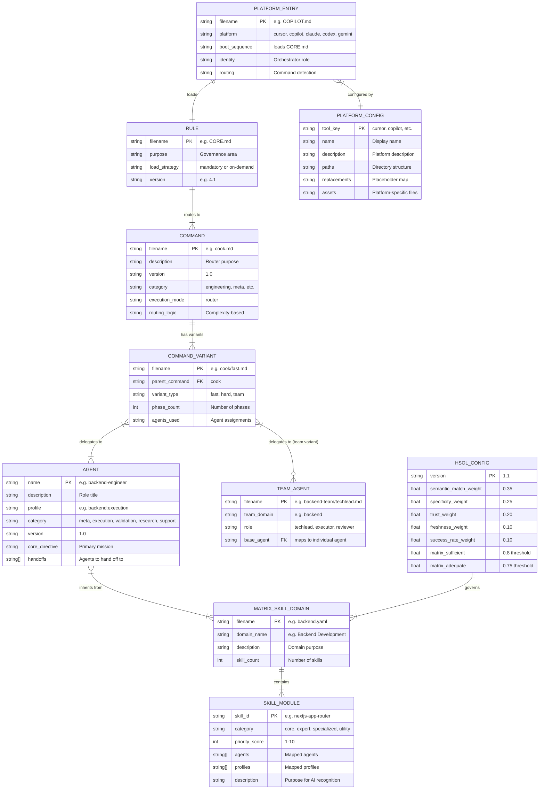

# Knowledge Domain

> **Purpose**: Domain model summary, entity overview, bounded contexts, and cross-references for the BoomOpen Workflow Kit framework
> **Last Updated**: 2026-03-26
> **Generated By**: docs-core skill

---

## Quick Summary

BoomOpen Workflow Kit's domain model is entirely file-based — every entity is a Markdown or YAML file stored in a well-defined directory structure. There is no database, no HTTP API, and no traditional ORM. The AI model reads these files at runtime as its operating instructions. The domain comprises 10 core entity types organized across 5 bounded contexts: Orchestration (rules and governance), Workflow (commands and variants), Agency (individual and team agents), Knowledge (matrix skill domains and skill modules), and Distribution (platform configs and entry points). Together, these entities define a framework of 21 specialist agents, 14 command routers with 54 workflow variants, 1,430 skills across 19 domains, and deployment to 5 AI coding platforms.

---

## Table of Contents

1. [Quick Summary](#quick-summary)
2. [Sub-Files](#sub-files)
3. [Entity Overview Diagram](#entity-overview-diagram)
4. [Quick Facts](#quick-facts)
5. [Bounded Contexts](#bounded-contexts)
6. [Cross-References](#cross-references)
7. [Known Gaps and Open Questions](#known-gaps-and-open-questions)

---

## Sub-Files

| # | File | Description |
|---|------|-------------|
| 1 | [01-entities.md](./01-entities.md) | Per-entity deep dive: attributes, types, constraints, relationships, and entity-relationship diagrams |
| 2 | [02-database-schema.md](./02-database-schema.md) | Explanation of the file-based data model (YAML frontmatter as schema, directory structure as organization) |
| 3 | [03-api-contracts.md](./03-api-contracts.md) | CLI interface specs, Prompt Command Interface (14 commands), and HSOL skill resolution protocol |
| 4 | [04-business-rules.md](./04-business-rules.md) | All business logic: Orchestration Laws, Tiered Execution, Phase Sequencing, HSOL Fitness Scoring, Trust Progression, Error Classification, Golden Triangle Debate, Deliverable Integrity |

---

## Entity Overview Diagram

---

## Quick Facts

| Key | Value |
|-----|-------|
| Total Entity Types | 10 |
| Bounded Contexts | 5 |
| Storage Format | Markdown (`.md`) + YAML (`.yaml`) |
| Schema Mechanism | YAML frontmatter in Markdown files |
| Database | None (file-based) |
| API | CLI commands + Prompt commands (no HTTP) |
| Individual Agents | 21 |
| Team Configurations | 17 teams × 3 roles = 51 team agents |
| Commands | 14 routers |
| Command Variants | 54 total |
| Rules | 7 files |
| Matrix Skill Domains | 19 + 2 special (_index.yaml, _dynamic.yaml) |
| Skill Modules | 1,430 |
| Supported Platforms | 5 (Cursor, Copilot, Claude, Codex, Antigravity/Gemini) |
| Platform Entry Points | 6 files (AGENT.md + 5 platform-specific) |

---

## Bounded Contexts

### 1. Orchestration Context

Defines the governance rules and laws that control all framework behavior. The Orchestrator is the single entry point — it never implements, only delegates.

| Entity | Location | Count |
|--------|----------|-------|
| Rule | `rules/*.md` | 7 |
| HSOL Config | `matrix-skills/_index.yaml` | 1 |

### 2. Workflow Context

Defines how user requests are routed to phased workflows with sequential execution.

| Entity | Location | Count |
|--------|----------|-------|
| Command | `commands/*.md` | 14 |
| Command Variant | `commands/{cmd}/*.md` | 54 |

### 3. Agency Context

Defines the specialist agents that perform work, both individually and in teams.

| Entity | Location | Count |
|--------|----------|-------|
| Agent | `agents/*.md` | 21 |
| Team Agent | `agents/teams/{domain}-team/*.md` | 51 |

### 4. Knowledge Context

Defines the skill matrix that provides domain expertise to agents.

| Entity | Location | Count |
|--------|----------|-------|
| Matrix Skill Domain | `matrix-skills/*.yaml` | 19 |
| Skill Module | `skills/*/SKILL.md` | 1,430 |

### 5. Distribution Context

Defines how the framework is packaged and deployed to different AI platforms.

| Entity | Location | Count |
|--------|----------|-------|
| Platform Config | `cli/install.js` TOOLS object | 5 |
| Platform Entry Point | Root `*.md` files | 6 |

---

## Cross-References

| Topic | See |
|-------|-----|
| System architecture and data flow | [knowledge-architecture/00-index.md](../knowledge-architecture/00-index.md) |
| Project identity, tech stack, features | [knowledge-overview/00-index.md](../knowledge-overview/00-index.md) |
| HSOL orchestration blueprint | [SMART-SKILL-ORCHESTRATION-BLUEPRINT.md](../SMART-SKILL-ORCHESTRATION-BLUEPRINT.md) |
| Entity attributes and relationships | [01-entities.md](./01-entities.md) |
| File-based storage model | [02-database-schema.md](./02-database-schema.md) |
| CLI and Prompt Command interfaces | [03-api-contracts.md](./03-api-contracts.md) |
| Business rules and governance logic | [04-business-rules.md](./04-business-rules.md) |

---

## Known Gaps and Open Questions

1. **No formal schema validation** — YAML frontmatter in agent/command files is not programmatically validated against a schema definition. Correctness relies on convention.
2. **Skill module content structure** — While `SKILL.md` is the standard filename, the internal structure of skill modules is not enforced by a shared template across all 1,430 skills.
3. **Dynamic skill lifecycle tracking** — The `_dynamic.yaml` manifest tracks community skills, but runtime execution counts and success rates depend on the AI platform's ability to persist state between sessions.
4. **Team agent file standardization** — Team agent files (`techlead.md`, `executor.md`, `reviewer.md`) follow the Golden Triangle protocol, but their frontmatter schema is not documented in the same detail as individual agents.
5. **Cross-platform behavioral parity** — The 5 platforms have different capabilities (sub-agent support, file access, tool availability), but per-platform behavioral differences are not formally documented as entity constraints.

---

## Evidence Sources

| Source | Path |
|--------|------|
| Package manifest | `package.json` |
| CLI installer (TOOLS config) | `cli/install.js` |
| Core rules | `rules/CORE.md` |
| Agent handling rules | `rules/AGENTS.md` |
| Phase execution rules | `rules/PHASES.md` |
| Skill resolution rules | `rules/SKILLS.md` |
| Team protocol rules | `rules/TEAMS.md` |
| Error handling rules | `rules/ERRORS.md` |
| Reference tables | `rules/REFERENCE.md` |
| HSOL index config | `matrix-skills/_index.yaml` |
| Example agent file | `agents/backend-engineer.md` |
| Example command router | `commands/cook.md` |
| Platform entry points | `AGENT.md`, `CLAUDE.md`, `COPILOT.md`, `CURSOR.md`, `CODEX.md`, `GEMINI.md` |
