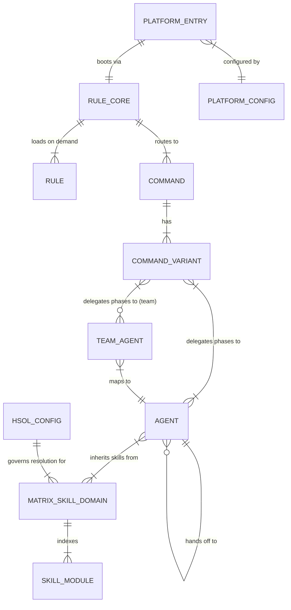

# BoomOpen Workflow Kit — Domain Entities

> **Purpose**: Complete per-entity deep dive with attributes, types, constraints, and relationships
> **Parent**: [00-index.md](./00-index.md)
> **Last Updated**: 2026-03-26
> **Generated By**: docs-core skill

---

## Table of Contents

1. [Entity Relationship Diagram](#entity-relationship-diagram)
2. [Entity 1: Agent](#entity-1-agent)
3. [Entity 2: Team Agent](#entity-2-team-agent)
4. [Entity 3: Command](#entity-3-command)
5. [Entity 4: Command Variant](#entity-4-command-variant)
6. [Entity 5: Rule](#entity-5-rule)
7. [Entity 6: Matrix Skill Domain](#entity-6-matrix-skill-domain)
8. [Entity 7: Skill Module](#entity-7-skill-module)
9. [Entity 8: Platform Config](#entity-8-platform-config)
10. [Entity 9: Platform Entry Point](#entity-9-platform-entry-point)
11. [Entity 10: HSOL Config](#entity-10-hsol-config)

---

## Entity Relationship Diagram

---

## Entity 1: Agent

**Location**: `agents/*.md` (21 files)
**Format**: Markdown with YAML frontmatter
**Role**: Specialist workers that the Orchestrator delegates to during workflow phases

### Frontmatter Attributes

| Attribute | Type | Required | Constraints | Example |
|-----------|------|----------|-------------|---------|
| `name` | string | yes | Unique across all agents; kebab-case | `backend-engineer` |
| `description` | string | yes | One-line role summary | `Principal Backend Architect — server-side logic, API design, scalable systems` |
| `profile` | string | yes | Format: `{domain}:{category}` — maps to HSOL resolution | `backend:execution` |
| `handoffs` | string[] | yes | List of agent names this agent can delegate to | `[tester, database-architect, performance-engineer]` |
| `version` | string | yes | Semantic version of agent definition | `1.0` |
| `category` | enum | yes | One of: `meta`, `execution`, `validation`, `research`, `support` | `execution` |

### Body Sections

| Section | Required | Purpose |
|---------|----------|---------|
| Core Directive | yes | Single sentence defining the agent's primary mission |
| Expert Mindset | yes | YAML block of thinking patterns (THINK_LIKE, ALWAYS) |
| Thinking Protocol | yes | Multi-step decision procedure (Step 0: Context Check, Step 1+: domain-specific) |
| Skills | yes | HSOL matrix discovery declaration (profile + inherited domains) |
| Constraints | yes | Boundaries and prohibitions for the agent |
| Output Format | yes | Expected deliverable structure |

### Category Distribution

| Category | Agents | Names |
|----------|--------|-------|
| meta | 2 | tech-lead, planner |
| execution | 5 | backend-engineer, frontend-engineer, database-architect, mobile-engineer, game-engineer |
| validation | 5 | tester, reviewer, security-engineer, performance-engineer, debugger |
| research | 4 | researcher, scouter, brainstormer, designer |
| support | 5 | docs-manager, devops-engineer, business-analyst, project-manager, reporter |

### Agent Profile Mappings

| Agent | Profile | Primary Domain | Inherited Domains |
|-------|---------|---------------|-------------------|
| backend-engineer | `backend:execution` | backend | backend, architecture, quality, data, languages |
| frontend-engineer | `frontend:execution` | frontend | frontend, design, architecture |
| tech-lead | `architecture:orchestration` | architecture | architecture, quality, planning |
| researcher | `research:analysis` | research | research, planning |
| debugger | `quality:debugging` | quality | quality, performance |
| tester | `quality:validation` | quality | quality |
| security-engineer | `security:validation` | security | security, architecture |
| designer | `design:creative` | design | design, frontend |
| planner | `planning:analysis` | planning | planning, architecture |
| devops-engineer | `devops:execution` | devops | devops, security, cloud |
| database-architect | `data:execution` | data | data, performance, architecture |
| performance-engineer | `performance:validation` | performance | performance, backend, frontend |
| scouter | `research:exploration` | research | research, architecture |
| reviewer | `quality:review` | quality | quality, security, architecture |
| mobile-engineer | `mobile:execution` | mobile | mobile, design, frontend |
| game-engineer | `gaming:execution` | gaming | gaming, performance, frontend |
| brainstormer | `planning:discovery` | planning | planning, research |
| business-analyst | `planning:business` | planning | planning, management |
| docs-manager | `research:documentation` | research | research, planning, tools, quality |
| reporter | `reporting:synthesis` | research | research, planning, tools, quality |
| project-manager | `management:orchestration` | management | management, planning |

### Relationships

| Direction | Target Entity | Cardinality | Description |
|-----------|---------------|-------------|-------------|
| Agent → Agent | Agent | many-to-many | Via `handoffs` array — defines allowed delegation chain |
| Agent → Matrix Skill Domain | Matrix Skill Domain | many-to-many | Via `inherit_from` in agent profile mapping |
| Command Variant → Agent | Agent | many-to-many | Variants assign agents to specific phases |

---

## Entity 2: Team Agent

**Location**: `agents/teams/{domain}-team/*.md` (51 files = 17 teams × 3 roles)
**Format**: Markdown with YAML frontmatter
**Role**: Golden Triangle role definitions for team-based workflow execution

### Structure

Each team domain folder contains exactly 3 files:

| File | Role | Purpose |
|------|------|---------|
| `techlead.md` | Tech Lead | Task decomposer, dispute arbitrator, final authority |
| `executor.md` | Executor | Direct implementer, builds deliverables, defends work |
| `reviewer.md` | Reviewer | Quality gatekeeper, Devil's Advocate, challenges work |

### Team Roster

| Team Domain | Tech Lead Agent | Executor Agent | Reviewer Focus |
|-------------|----------------|----------------|----------------|
| backend | tech-lead | backend-engineer | reviewer — security + performance |
| frontend | tech-lead | frontend-engineer | reviewer — design + performance |
| fullstack | tech-lead | backend-engineer + frontend-engineer | reviewer — security + performance |
| database | tech-lead | database-architect | reviewer — security + performance |
| research | researcher | scouter | brainstormer — critical evaluator |
| planning | planner | researcher | tech-lead — feasibility critic |
| qa | tester | tester | security-engineer + performance-engineer |
| design | designer | frontend-engineer | reviewer — UX + accessibility |
| debug | debugger | backend-engineer | reviewer — root-cause validator |
| devops | devops-engineer | backend-engineer | security-engineer |
| security | security-engineer | backend-engineer | reviewer — pen-test mindset |
| game | tech-lead | game-engineer | reviewer — game architecture + 60fps |
| mobile | tech-lead | mobile-engineer | reviewer — UX + platform compliance |
| performance | performance-engineer | backend-engineer | reviewer — measurement + regression |
| docs | docs-manager | researcher | reviewer — accuracy + completeness |
| project | project-manager | business-analyst | tech-lead — feasibility critic |
| report | reporter | scouter | reviewer — data accuracy + insight |

### Relationships

| Direction | Target Entity | Cardinality | Description |
|-----------|---------------|-------------|-------------|
| Team Agent → Agent | Agent | many-to-one | Each team role maps to an individual agent definition |
| Command Variant (`:team`) → Team Agent | Team Agent | one-to-many | Team variants spawn all 3 roles per phase |

### Constraints

- Exactly 3 roles per team, no exceptions
- Debate mechanism: max 3 rounds per task
- Output requires explicit consensus stamp: `✅ CONSENSUS: TechLead ✓ | Executor ✓ | Reviewer ✓`
- Communication through append-only Mailbox (`./reports/{topic}/MAILBOX-{date}.md`)

---

## Entity 3: Command

**Location**: `commands/*.md` (14 files)
**Format**: Markdown with YAML frontmatter
**Role**: Router files that analyze user input and route to the appropriate workflow variant

### Frontmatter Attributes

| Attribute | Type | Required | Constraints | Example |
|-----------|------|----------|-------------|---------|
| `description` | string | yes | Router purpose | `🍳 Cook Router — Route to feature implementation workflows` |
| `version` | string | yes | Semantic version | `1.0` |
| `category` | string | yes | Domain category | `engineering` |
| `execution-mode` | enum | yes | Always `router` for commands | `router` |

### Body Sections

| Section | Required | Purpose |
|---------|----------|---------|
| Pre-Flight | yes | Mandatory rule loading (CORE.md, PHASES.md, AGENTS.md) |
| Routing Logic | yes | Conditional logic to select variant based on complexity/context |
| Available Routes | yes | Table of all variants with usage guidance |
| Present Options | yes | User-facing selection prompt |

### Command Registry

| Command | Slug | Category | Variants |
|---------|------|----------|----------|
| /cook | `cook` | engineering | fast, hard, team |
| /code | `code` | engineering | fast, hard, team |
| /fix | `fix` | engineering | fast, hard, team |
| /debug | `debug` | validation | fast, hard, team |
| /test | `test` | validation | fast, hard, team |
| /plan | `plan` | planning | fast, hard, team |
| /design | `design` | design | fast, hard, team |
| /review | `review` | validation | fast, hard, team |
| /report | `report` | support | fast, hard, team |
| /brainstorm | `brainstorm` | research | fast, hard, team |
| /docs | `docs` | support | core, business, audit |
| /deploy | `deploy` | devops | check, preview, production, rollback |
| /ask | `ask` | support | fast, hard |
| /auto | `auto` | meta | (meta-router — selects another command) |

### Relationships

| Direction | Target Entity | Cardinality | Description |
|-----------|---------------|-------------|-------------|
| Command → Command Variant | Command Variant | one-to-many | Each router maps to 2-4 variant workflows |
| Rule (CORE.md) → Command | Command | one-to-many | CORE.md routing logic dispatches to commands |

---

## Entity 4: Command Variant

**Location**: `commands/{cmd}/*.md` (54 files total)
**Format**: Markdown with YAML frontmatter
**Role**: Complete phased workflow definitions with agent assignments per phase

### Frontmatter Attributes

| Attribute | Type | Required | Constraints | Example |
|-----------|------|----------|-------------|---------|
| `description` | string | yes | Variant purpose | `⚡ Cook Fast — Quick feature implementation` |
| `version` | string | yes | Semantic version | `1.0` |
| `category` | string | yes | Domain category | `engineering` |
| `execution-mode` | enum | yes | Always `workflow` | `workflow` |

### Body Structure

Each variant defines a sequence of phases:

| Phase Element | Purpose |
|---------------|---------|
| Phase number and name | Sequential identifier (Phase 1, Phase 2, etc.) |
| Agent assignment | Which agent executes this phase |
| Task description | What work the agent performs |
| Input constraints | Prior phase deliverables required |
| Exit criteria | Conditions that must be met to proceed |
| Deliverable | Output artifact(s) from the phase |

### Variant Types

| Type | Available In | Description |
|------|-------------|-------------|
| `fast` | cook, code, fix, debug, test, plan, design, report, brainstorm, ask | Minimal phases, quick execution, skip discovery |
| `hard` | cook, code, fix, debug, test, plan, design, review, report, brainstorm, ask | Full workflow, all phases, full skill resolution |
| `team` | cook, code, fix, debug, test, plan, design, review, report, brainstorm | Golden Triangle (3 agents per phase) |
| `core` | docs | Core documentation workflow |
| `business` | docs | Business documentation workflow |
| `audit` | docs | Documentation audit workflow |
| `check` | deploy | Pre-deployment verification |
| `preview` | deploy | Staging deployment |
| `production` | deploy | Production deployment |
| `rollback` | deploy | Deployment rollback |

### Relationships

| Direction | Target Entity | Cardinality | Description |
|-----------|---------------|-------------|-------------|
| Command Variant → Agent | Agent | many-to-many | Each phase assigns one agent |
| Command Variant → Team Agent | Team Agent | many-to-many | Team variants assign 3 agents per phase |
| Command → Command Variant | Command Variant | one-to-many | Router dispatches to variant |

---

## Entity 5: Rule

**Location**: `rules/*.md` (7 files)
**Format**: Pure Markdown
**Role**: Governance documents that define the Orchestrator's operating system

### Rule Files

| File | Load Strategy | Purpose | Key Contents |
|------|--------------|---------|--------------|
| `CORE.md` | Mandatory — always loaded first | Single source of truth for identity, laws, routing | Identity binding, paths, command routing, tiered execution, 10 Orchestration Laws, prohibitions |
| `PHASES.md` | On-demand — when running phases | Phase execution protocol | Requirements intake, phase output format, Golden Triangle format, execution rules, deliverable size management |
| `AGENTS.md` | On-demand — when delegating | Agent handling protocol | Tiered execution details, tool discovery, context model comparison, agent categories, Golden Triangle roster |
| `SKILLS.md` | On-demand — when resolving skills | HSOL resolution rules | Resolution algorithm, fitness calculation, decision flow, trust progression, dynamic discovery |
| `TEAMS.md` | On-demand — when `:team` variant | Golden Triangle architecture | 3 roles definition, debate mechanism, communication protocol, consensus protocol, team roster |
| `ERRORS.md` | On-demand — when errors occur | Self-healing protocols | Error classification (E1-E4), recovery protocol, user escalation, anti-patterns (A1-A10), resilience guarantees |
| `REFERENCE.md` | On-demand — quick lookup | Fast lookup tables | Command table, agent table, natural language detection, deliverable paths |

### Constraints

- `CORE.md` version 4.1 is the canonical operating system — must be loaded before any other action
- Rules are loaded on-demand to conserve context window
- Rules never contradict each other; `CORE.md` is authoritative when ambiguity arises

### Relationships

| Direction | Target Entity | Cardinality | Description |
|-----------|---------------|-------------|-------------|
| Rule (CORE.md) → Command | Command | one-to-many | Routing logic dispatches to commands |
| Rule → Agent | Agent | governance | Laws constrain all agent behavior |
| Platform Entry → Rule | Rule | one-to-one | Entry point boots by loading CORE.md |

---

## Entity 6: Matrix Skill Domain

**Location**: `matrix-skills/*.yaml` (19 domain files + 2 special files)
**Format**: YAML
**Role**: Indexed registries of skills organized by technical domain

### Domain File Attributes

| Attribute | Type | Required | Example |
|-----------|------|----------|---------|
| Domain key | string (PK) | yes | `backend` |
| `file` | string | yes | `backend.yaml` |
| `name` | string | yes | `Backend Development` |
| `description` | string | yes | `Server-side logic, APIs, data access` |
| `skill_count` | integer | yes | `208` |

### Domain Registry

| Domain Key | Name | Skill Count |
|------------|------|-------------|
| backend | Backend Development | 208 |
| frontend | Frontend Development | 109 |
| architecture | System Architecture | 22 |
| quality | Quality Assurance | 61 |
| security | Security Engineering | 102 |
| design | UI/UX Design | 28 |
| planning | Planning & Analysis | 38 |
| devops | DevOps & Deployment | 66 |
| data | Data & Database | 33 |
| performance | Performance Engineering | 22 |
| research | Research & Documentation | 83 |
| mobile | Mobile Development | 27 |
| gaming | Game Development | 14 |
| management | Project Management | 21 |
| ai_ml | AI/ML Engineering | 229 |
| cloud | Cloud & Infrastructure | 67 |
| languages | Programming Languages | 57 |
| tools | Tools & Utilities | 234 |
| mcp | MCP & Agents | 9 |
| **Total** | | **1,430** |

### Special Files

| File | Purpose |
|------|---------|
| `_index.yaml` | HSOL configuration: fitness weights, thresholds, trust progression, promotion pipeline, agent profile mappings, resolution rules |
| `_dynamic.yaml` | Community-installed dynamic skill tracking: owner, checksum, support state, promotion state, freshness metadata |

### Relationships

| Direction | Target Entity | Cardinality | Description |
|-----------|---------------|-------------|-------------|
| Matrix Skill Domain → Skill Module | Skill Module | one-to-many | Each domain indexes multiple skills |
| Agent → Matrix Skill Domain | Matrix Skill Domain | many-to-many | Via `inherit_from` in agent profile |
| HSOL Config → Matrix Skill Domain | Matrix Skill Domain | one-to-many | HSOL governs all domain resolution |

---

## Entity 7: Skill Module

**Location**: `skills/*/SKILL.md` (1,430 modules)
**Format**: Markdown
**Role**: Self-contained domain knowledge modules that provide expertise to agents

### Skill Entry Schema (in domain YAML)

| Attribute | Type | Required | Constraints | Example |
|-----------|------|----------|-------------|---------|
| `skill_id` | string (PK) | yes | Unique across all domains | `nextjs-app-router` |
| `category` | enum | yes | One of: `core`, `expert`, `specialized`, `utility` | `core` |
| `priority_score` | integer | yes | Range: 1-10 | `9` |
| `relevance_mapping.agents` | string[] | yes | List of agent IDs this skill applies to | `[backend-engineer, frontend-engineer]` |
| `relevance_mapping.profiles` | string[] | yes | Profile patterns | `[backend:execution, frontend:*]` |
| `description` | string | yes | Concise purpose for AI pattern matching | `Next.js App Router patterns and best practices` |

### Priority Guide

| Score | Category | Usage |
|-------|----------|-------|
| 10 | Critical | Always required for the domain |
| 9 | Core | Standard for the domain |
| 8 | Expert | Specialized but commonly needed |
| 7 | Core | Useful in most domain contexts |
| 5-6 | Utility | Context-dependent usage |
| 1-4 | Rare | Edge cases only |

### SKILL.md File Structure

Each `SKILL.md` contains domain expertise that the AI agent reads and applies during task execution. The file provides patterns, best practices, code examples, and constraints specific to a technology, pattern, or technique.

### Relationships

| Direction | Target Entity | Cardinality | Description |
|-----------|---------------|-------------|-------------|
| Skill Module → Matrix Skill Domain | Matrix Skill Domain | many-to-one | Indexed in a domain's YAML file |
| Agent → Skill Module | Skill Module | many-to-many | Injected via HSOL fitness resolution |

---

## Entity 8: Platform Config

**Location**: `cli/install.js` — TOOLS object (5 configurations)
**Format**: JavaScript object literal
**Role**: Defines installation paths, placeholder replacements, and platform-specific assets for each supported AI tool

### Platform Config Attributes

| Attribute | Type | Required | Description |
|-----------|------|----------|-------------|
| `name` | string | yes | Display name (e.g., `Cursor`) |
| `description` | string | yes | Platform description (e.g., `Cursor AI Editor`) |
| `paths` | object | yes | Directory paths for the platform (home, skills, agents, commands, boomopenWorkflowKit) |
| `replacements` | object | yes | Placeholder-to-value map for `{TOOL}`, `{HOME}`, path patterns |
| `assets` | object | yes | Platform-specific files to copy (rules, entry points, configs) |

### Platforms

| Tool Key | Name | Home Directory | BoomOpen Workflow Kit Path |
|----------|------|----------------|---------------------|
| `cursor` | Cursor | `~/.cursor/` | `~/.cursor/skills/boomopen-workflow-kit/` |
| `copilot` | GitHub Copilot | `~/.copilot/` | `~/.copilot/skills/boomopen-workflow-kit/` |
| `antigravity` | Antigravity (Gemini) | `~/.antigravity/` + `~/.gemini/` | `~/.gemini/antigravity/skills/boomopen-workflow-kit/` |
| `claude` | Claude Code | `~/.claude/` | `~/.claude/skills/boomopen-workflow-kit/` |
| `codex` | Codex | `~/.codex/` | `~/.codex/skills/boomopen-workflow-kit/` |

### Core Directories Copied

The installer copies these directories into each platform's `boomopenWorkflowKit` path:

| Directory | Contents |
|-----------|----------|
| `agents/` | 21 individual agents + 17 team folders |
| `rules/` | 7 governance files |
| `documents/` | Knowledge base folders |
| `commands/` | 14 routers + 54 variant workflows |
| `matrix-skills/` | 19 domain YAMLs + 2 special files |

### Placeholder Replacement

During installation, the following placeholders in all Markdown/YAML files are replaced with platform-specific values:

| Placeholder | Description | Example (Cursor) |
|-------------|-------------|-------------------|
| `~/.{TOOL}/skills/boomopen-workflow-kit/` | boomopen workflow kit root | `~/.cursor/skills/boomopen-workflow-kit/` |
| `{TOOL}/boomopen-workflow-kit/` | Relative path | `cursor/skills/boomopen-workflow-kit/` |
| `{TOOL}` | Tool identifier | `cursor` |
| `{HOME}` | Home directory | `~` |
| `~/.agent/` | Legacy agent path | `~/.cursor/skills/boomopen-workflow-kit/` |

### Relationships

| Direction | Target Entity | Cardinality | Description |
|-----------|---------------|-------------|-------------|
| Platform Config → Platform Entry Point | Platform Entry Point | one-to-one | Each config corresponds to a platform entry |

---

## Entity 9: Platform Entry Point

**Location**: Root directory (6 files)
**Format**: Markdown
**Role**: Boot sequence files that initialize the Orchestrator identity and load CORE.md

### Files

| File | Platform | Purpose |
|------|----------|---------|
| `AGENT.md` | Generic/Cursor | Default agent identity file |
| `CLAUDE.md` | Claude Code | Claude-specific boot with CLAUDE.md path conventions |
| `COPILOT.md` | GitHub Copilot | Copilot-specific boot (used as `.github/copilot-instructions.md` or prompts) |
| `CURSOR.md` | Cursor | Cursor-specific boot (copied to `.cursor/rules/`) |
| `CODEX.md` | Codex | Codex-specific boot with TOML config references |
| `GEMINI.md` | Antigravity/Gemini | Gemini-specific boot with antigravity path conventions |

### Body Structure

All entry points follow the same pattern:

1. **Identity binding** — Declares the Orchestrator role
2. **Mandatory boot** — READ `CORE.md` immediately
3. **Path configuration** — Platform-specific paths
4. **Command routing** — How to detect and dispatch commands
5. **Execution flow** — Phase execution reference

### Relationships

| Direction | Target Entity | Cardinality | Description |
|-----------|---------------|-------------|-------------|
| Platform Entry → Rule (CORE.md) | Rule | one-to-one | Boot sequence always loads CORE.md first |
| Platform Config → Platform Entry | Platform Entry Point | one-to-one | Installer deploys the correct entry point per platform |

---

## Entity 10: HSOL Config

**Location**: `matrix-skills/_index.yaml` — `hsol` block
**Format**: YAML
**Role**: Central configuration for the Hybrid Skill Orchestration Layer including fitness scoring, thresholds, trust progression, and promotion pipeline

### Attributes

| Attribute | Type | Value | Description |
|-----------|------|-------|-------------|
| `hsol.enabled` | boolean | `true` | HSOL active |
| `hsol.version` | string | `1.1` | HSOL protocol version |
| `hsol.fitness_weights.semantic_match` | float | `0.35` | Weight for semantic relevance |
| `hsol.fitness_weights.specificity_score` | float | `0.25` | Weight for skill specificity |
| `hsol.fitness_weights.trust_level` | float | `0.20` | Weight for trust rating |
| `hsol.fitness_weights.freshness_score` | float | `0.10` | Weight for recency |
| `hsol.fitness_weights.success_rate` | float | `0.10` | Weight for historical success |
| `hsol.thresholds.matrix_sufficient` | float | `0.8` | Above: execute with matrix, skip discovery |
| `hsol.thresholds.matrix_adequate` | float | `0.75` | Below: blocking discovery required |
| `hsol.thresholds.superiority_delta` | float | `0.15` | Dynamic must exceed matrix by this delta |
| `hsol.discovery.enabled` | boolean | `true` | Dynamic discovery enabled |
| `hsol.discovery.timeout_ms` | integer | `5000` | Discovery timeout in milliseconds |
| `hsol.discovery.cache_ttl_seconds` | integer | `3600` | Cache time-to-live |
| `hsol.discovery.async_threshold` | float | `0.8` | Matrix fitness above this skips discovery |
| `hsol.discovery.apply_for_variants` | string[] | `[hard, team]` | Variants that trigger discovery |
| `hsol.trust.new_skill` | float | `0.3` | Initial trust for new skills |
| `hsol.trust.after_3_executions` | float | `0.5` | Trust after 3 successes |
| `hsol.trust.after_10_executions` | float | `0.7` | Trust after 10 successes |
| `hsol.trust.matrix_promoted` | float | `1.0` | Trust for promoted matrix skills |
| `hsol.trust.decay_after_days` | integer | `90` | Days before trust starts decaying |
| `hsol.promotion.enabled` | boolean | `true` | Auto-promotion enabled |
| `hsol.promotion.min_executions` | integer | `10` | Minimum executions to promote |
| `hsol.promotion.min_success_rate` | float | `0.85` | Minimum success rate to promote |
| `hsol.promotion.max_inactive_days` | integer | `30` | Max days inactive before promotion blocked |
| `hsol.promotion.automatic` | boolean | `true` | Auto-promote when criteria met |

### Dynamic Manifest Governance Fields

Required fields for each entry in `_dynamic.yaml`:

| Field | Type | Description |
|-------|------|-------------|
| `owner` | string | Skill author/repository |
| `checksum` | string | Integrity hash |
| `support_state` | enum | `supported`, `experimental`, `blocked` |
| `promotion_state` | enum | `new`, `evaluating`, `validated`, `promoted`, `blocked` |
| `freshness.last_verified` | date | Last verification timestamp |
| `freshness.stale_after_days` | integer | Days until considered stale |
| `installed_at` | date | Installation timestamp |
| `last_execution` | date | Last usage timestamp |

### Relationships

| Direction | Target Entity | Cardinality | Description |
|-----------|---------------|-------------|-------------|
| HSOL Config → Matrix Skill Domain | Matrix Skill Domain | one-to-many | Governs resolution across all 19 domains |
| HSOL Config → Agent (profiles) | Agent | one-to-many | Maps agent profiles to domain inheritance |

---

## Evidence Sources

| Source | Path |
|--------|------|
| Agent file example | `agents/backend-engineer.md` |
| All agent files | `agents/*.md` |
| Team agent files | `agents/teams/` |
| Command router example | `commands/cook.md` |
| All command files | `commands/*.md` |
| Rule files | `rules/CORE.md`, `rules/PHASES.md`, `rules/AGENTS.md`, `rules/SKILLS.md`, `rules/TEAMS.md`, `rules/ERRORS.md`, `rules/REFERENCE.md` |
| HSOL config and domain registry | `matrix-skills/_index.yaml` |
| Dynamic manifest | `matrix-skills/_dynamic.yaml` |
| Domain YAML files | `matrix-skills/*.yaml` |
| Skill modules | `skills/*/SKILL.md` |
| CLI installer (Platform Config) | `cli/install.js` |
| Platform entry points | `AGENT.md`, `CLAUDE.md`, `COPILOT.md`, `CURSOR.md`, `CODEX.md`, `GEMINI.md` |
| Package manifest | `package.json` |
