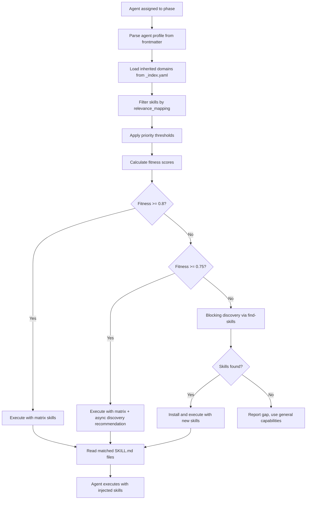

# BoomOpen Workflow Kit — API Contracts

> **Purpose**: CLI interface specifications, Prompt Command Interface, and HSOL skill resolution protocol
> **Parent**: [00-index.md](./00-index.md)
> **Last Updated**: 2026-03-26
> **Generated By**: docs-core skill

---

## Table of Contents

1. [API Overview](#api-overview)
2. [CLI Interface](#cli-interface)
3. [Prompt Command Interface](#prompt-command-interface)
4. [HSOL Skill Resolution Protocol](#hsol-skill-resolution-protocol)

---

## API Overview

BoomOpen Workflow Kit exposes two distinct interfaces, neither of which is an HTTP API:

| Interface | Type | Consumer | Entry Point |
|-----------|------|----------|-------------|
| CLI Interface | Node.js command-line tool | Developer's terminal | `cli/install.js` |
| Prompt Command Interface | Natural language commands | AI model at runtime | Platform entry points (`COPILOT.md`, etc.) |

There is also an internal resolution protocol — the HSOL (Hybrid Skill Orchestration Layer) — that functions as a "skill API" the AI model executes to inject domain expertise into agents.

---

## CLI Interface

### Global Information

| Property | Value |
|----------|-------|
| Binary name | `boomopen-workflow-kit` |
| Entry point | `cli/install.js` |
| Runtime | Node.js >= 18.0.0 |
| Dependencies | Zero (uses only `node:fs`, `node:path`, `node:os`, `node:readline`) |
| Package | `@namch/boomopen-workflow-kit` on npm |

### Commands

#### `boomopen-workflow-kit install <tool>`

Installs the framework to a specific AI platform's global directory.

| Parameter | Type | Required | Valid Values | Description |
|-----------|------|----------|--------------|-------------|
| `tool` | string | yes (unless `--all`) | `cursor`, `copilot`, `antigravity`, `claude`, `codex` | Target AI platform |
| `--all` | flag | no | — | Install for all 5 platforms |

**Behavior**:

1. Resolves the platform's installation paths from the TOOLS configuration object
2. Creates the directory structure (`skills/boomopen-workflow-kit/`, `agents/`, `commands/`, `rules/`, `matrix-skills/`, `documents/`)
3. Copies core directories: `agents/`, `rules/`, `documents/`, `commands/`, `matrix-skills/`
4. Copies `skills/` directory (1,430 skill modules)
5. Performs `{TOOL}` placeholder replacement in all Markdown and YAML files
6. Copies platform-specific assets (entry point files, config files)
7. Copies root files (`README.md`)
8. Displays progress bar with file count
9. Runs verification to confirm all files were written
10. Prints summary report with statistics

**Exit codes**:

| Code | Meaning |
|------|---------|
| 0 | Success |
| 1 | Invalid tool name or installation error |

**npm script shortcuts**:

| Script | Equivalent |
|--------|-----------|
| `npm run install:cursor` | `node cli/install.js install cursor` |
| `npm run install:copilot` | `node cli/install.js install copilot` |
| `npm run install:antigravity` | `node cli/install.js install antigravity` |
| `npm run install:codex` | `node cli/install.js install codex` |
| `npm run install:all` | `node cli/install.js install --all` |

---

#### `boomopen-workflow-kit uninstall <tool>`

Removes the framework from a specific AI platform's global directory.

| Parameter | Type | Required | Valid Values | Description |
|-----------|------|----------|--------------|-------------|
| `tool` | string | yes (unless `--all`) | `cursor`, `copilot`, `antigravity`, `claude`, `codex` | Target AI platform |
| `--all` | flag | no | — | Uninstall from all 5 platforms |

**Behavior**:

1. Resolves the platform's `boomopenWorkflowKit` path
2. Removes only bundled agent files (preserves user-custom agents)
3. Removes the `skills/boomopen-workflow-kit/` directory tree
4. Removes platform-specific assets installed by the framework

**npm script shortcuts**:

| Script | Equivalent |
|--------|-----------|
| `npm run uninstall:cursor` | `node cli/install.js uninstall cursor` |
| `npm run uninstall:copilot` | `node cli/install.js uninstall copilot` |
| `npm run uninstall:antigravity` | `node cli/install.js uninstall antigravity` |
| `npm run uninstall:codex` | `node cli/install.js uninstall codex` |
| `npm run uninstall:all` | `node cli/install.js uninstall --all` |

---

#### `boomopen-workflow-kit list`

Lists which platforms currently have the framework installed.

| Parameter | Type | Required | Description |
|-----------|------|----------|-------------|
| (none) | — | — | No arguments |

**Behavior**:

1. Checks each platform's `boomopenWorkflowKit` path for existence
2. Prints a list of installed platforms with status indicators

**npm script shortcut**: `npm run list`

---

### Installation File Mapping

The installer copies these directories from the npm package into platform-specific paths:

| Source Directory | Destination (relative to `boomopenWorkflowKit` path) | Contents |
|-----------------|------------------------------------------------|----------|
| `agents/` | `agents/` | 21 individual agents + 17 team folders (51 role files) |
| `rules/` | `rules/` | 7 governance files |
| `documents/` | `documents/` | Knowledge base folders |
| `commands/` | `commands/` | 14 routers + variant subfolders (54 variant files) |
| `matrix-skills/` | `matrix-skills/` | 19 domain YAMLs + `_index.yaml` + `_dynamic.yaml` |
| `skills/` | Installed to `{SKILLS_PATH}/` | 1,430 skill modules |
| `README.md` | `README.md` | Project readme |

### Platform-Specific Asset Mapping

| Platform | Asset | Source | Destination |
|----------|-------|--------|-------------|
| Cursor | Rules directory | `code-assistants/cursor-assistant/rules/` | `~/.cursor/rules/` |
| Cursor | Cursorrules | `code-assistants/cursor-assistant/.cursorrules` | `~/.cursor/.cursorrules` |
| Copilot | Agent file | `code-assistants/copilot-assistant/boomopen-workflow-kit.agent.md` | VS Code prompts folder |
| Antigravity | Gemini config | `code-assistants/antigravity-assistant/GEMINI.md` | `~/.gemini/GEMINI.md` |
| Antigravity | Agent file | `code-assistants/antigravity-assistant/AntigravityGlobal.agent.md` | `~/.gemini/agents/` |
| Claude | Claude config | `code-assistants/claude-assistant/CLAUDE.md` | `~/.claude/CLAUDE.md` |
| Codex | Codex config | `code-assistants/codex-assistant/CODEX.md` | `~/.codex/CODEX.md` |
| Codex | TOML config | `code-assistants/codex-assistant/config.toml` | `~/.codex/config.toml` |
| Codex | Agent TOMLs | `code-assistants/codex-assistant/agents/` | `~/.codex/agents/` |
| Codex | Command skills | `code-assistants/codex-assistant/skills/` | `~/.codex/skills/` |

---

## Prompt Command Interface

These commands are used inside AI coding assistants after the framework is installed. The AI model parses these from user input and routes them through the Orchestrator.

### Command Syntax

```
/{command}                    → Routes to default variant (presents options)
/{command}:{variant}          → Routes directly to specific variant
/{command}/{variant}          → Alternative syntax (same effect)
```

Arguments follow the command:

```
/cook implement user authentication with JWT
/fix the login button is not working
/plan migration from REST to GraphQL
```

### Natural Language Detection

The Orchestrator also detects commands from natural language:

| User Intent | Detected Command |
|-------------|-----------------|
| implement, build, create, add | `/cook` |
| fix, bug, error, broken | `/fix` |
| plan, how should, strategy, approach | `/plan` |
| debug, investigate, why | `/debug` |
| test, coverage | `/test` |
| review, PR, check code | `/review` |
| document, readme, docs, spec | `/docs` |
| design, UI, UX, mockup | `/design` |
| deploy, release | `/deploy` |
| report, status, summary | `/report` |
| brainstorm, ideas, explore | `/brainstorm` |
| question, how, what, why | `/ask` |
| code, snippet, generate | `/code` |

### Command Specifications

#### `/cook` — Feature Implementation

| Property | Value |
|----------|-------|
| Purpose | Implement new features end-to-end |
| Input | Feature description |
| Variants | `fast`, `hard`, `team` |
| Default routing | Simple spec → fast; Complex → hard; Max quality → team |

| Variant | Phases | Discovery | Team |
|---------|--------|-----------|------|
| `fast` | Minimal (typically 2-3) | Matrix only, skip dynamic | Single agent per phase |
| `hard` | Full (typically 5-7) | Matrix + dynamic discovery | Single agent per phase |
| `team` | Full with Golden Triangle | Matrix + dynamic discovery | 3 agents per phase |

#### `/code` — Code Generation

| Property | Value |
|----------|-------|
| Purpose | Generate code snippets or modules |
| Input | Code specification |
| Variants | `fast`, `hard`, `team` |
| Default routing | Same as `/cook` |

#### `/fix` — Bug Fixing

| Property | Value |
|----------|-------|
| Purpose | Identify and fix bugs |
| Input | Bug description or error message |
| Variants | `fast`, `hard`, `team` |
| Default routing | Clear bug → fast; Complex/multi-component → hard |

#### `/debug` — Debugging

| Property | Value |
|----------|-------|
| Purpose | Deep investigation of issues |
| Input | Issue description or symptoms |
| Variants | `fast`, `hard`, `team` |
| Default routing | Quick investigation → fast; Root cause analysis → hard |

#### `/test` — Test Generation

| Property | Value |
|----------|-------|
| Purpose | Generate test suites |
| Input | Component or feature to test |
| Variants | `fast`, `hard`, `team` |
| Default routing | Unit tests → fast; Full coverage strategy → hard |

#### `/plan` — Planning

| Property | Value |
|----------|-------|
| Purpose | Create implementation plans and task breakdowns |
| Input | Feature or project to plan |
| Variants | `fast`, `hard`, `team` |
| Default routing | Quick plan → fast; Detailed architecture → hard |

#### `/design` — UI/UX Design

| Property | Value |
|----------|-------|
| Purpose | Design user interfaces and experiences |
| Input | UI/UX requirements |
| Variants | `fast`, `hard`, `team` |
| Default routing | Simple component → fast; Full design system → hard |

#### `/review` — Code Review

| Property | Value |
|----------|-------|
| Purpose | Review code for quality, security, performance |
| Input | Code or PR to review |
| Variants | `fast`, `hard`, `team` |
| Default routing | Quick check → fast; Thorough review → hard |

#### `/report` — Reporting

| Property | Value |
|----------|-------|
| Purpose | Generate reports and summaries |
| Input | Topic or scope for report |
| Variants | `fast`, `hard`, `team` |
| Default routing | Quick summary → fast; Detailed analysis → hard |

#### `/brainstorm` — Ideation

| Property | Value |
|----------|-------|
| Purpose | Explore ideas and possibilities |
| Input | Topic or problem to brainstorm |
| Variants | `fast`, `hard`, `team` |
| Default routing | Quick ideas → fast; Deep exploration → hard |

#### `/docs` — Documentation

| Property | Value |
|----------|-------|
| Purpose | Generate or maintain documentation |
| Input | Documentation target |
| Variants | `core`, `business`, `audit` |
| Default routing | Technical docs → core; Business docs → business; Review existing → audit |

#### `/deploy` — Deployment

| Property | Value |
|----------|-------|
| Purpose | Manage deployment pipeline |
| Input | Deployment target or action |
| Variants | `check`, `preview`, `production`, `rollback` |
| Default routing | Pre-deploy verification → check; Staging → preview; Live → production; Undo → rollback |

#### `/ask` — Questions & Answers

| Property | Value |
|----------|-------|
| Purpose | Answer technical questions |
| Input | Question |
| Variants | `fast`, `hard` |
| Default routing | Simple question → fast; Research-heavy → hard |

#### `/auto` — Autonomous Execution

| Property | Value |
|----------|-------|
| Purpose | Analyze task and autonomously execute complete workflow |
| Input | Task description |
| Variants | (meta-router — selects another command autonomously) |
| Behavior | Classifies the task type, selects the optimal command and variant, executes all phases without user intervention between phases |

### Pre-Flight Loading (All Commands)

Every command router requires loading these rule files before execution:

| Order | File | Purpose |
|-------|------|---------|
| 1 | `CORE.md` | Identity, Laws, Routing |
| 2 | `PHASES.md` | Phase execution protocol |
| 3 | `AGENTS.md` | Tiered execution protocol |

Execution is blocked until all three are loaded.

### Variant Behavior Matrix

| Behavior | fast | hard | team |
|----------|------|------|------|
| Phase count | Minimal (2-3) | Full (5-7) | Full (5-7) |
| Skill discovery | Matrix only | Matrix + dynamic | Matrix + dynamic |
| Context clearing | No | No | No |
| Agents per phase | 1 | 1 | 3 (Golden Triangle) |
| Debate rounds | N/A | N/A | Up to 3 |
| Deliverable review | Exit criteria only | Exit criteria | Consensus stamp required |

---

## HSOL Skill Resolution Protocol

The Hybrid Skill Orchestration Layer is an internal protocol the AI model executes to inject relevant skills into agents during workflow phases.

### Resolution Flow



### Fitness Calculation Formula

```
fitness = 0.35 × SEMANTIC_MATCH
        + 0.25 × SPECIFICITY
        + 0.20 × TRUST_LEVEL
        + 0.10 × FRESHNESS_SCORE
        + 0.10 × SUCCESS_RATE
```

| Factor | Weight | Description | Range |
|--------|--------|-------------|-------|
| Semantic Match | 0.35 | How closely the skill's description matches the task keywords | 0.0 — 1.0 |
| Specificity | 0.25 | How specialized the skill is for this exact task (vs. general) | 0.0 — 1.0 |
| Trust Level | 0.20 | Matrix skills = 1.0; dynamic skills = 0.3 to 1.0 based on history | 0.3 — 1.0 |
| Freshness Score | 0.10 | How recently the skill was verified or updated | 0.0 — 1.0 |
| Success Rate | 0.10 | Historical success rate of the skill in prior executions | 0.0 — 1.0 |

### Decision Thresholds

| Threshold | Value | Action |
|-----------|-------|--------|
| Matrix Sufficient | >= 0.8 | Use matrix skills directly, skip dynamic discovery |
| Matrix Adequate | 0.75 — 0.8 | Use matrix skills, run async discovery for future recommendation |
| Matrix Insufficient | < 0.75 | Blocking discovery — wait for `find-skills` before proceeding |
| Superiority Delta | 0.15 | Dynamic skill must exceed matrix skill's fitness by this amount to be preferred |

### Profile-to-Domain Resolution

The HSOL maps agent profiles to skill domains via the `agent_profiles` section in `_index.yaml`:

```
1. PARSE agent's `profile` field (e.g., "backend:execution")
2. LOOK UP profile in _index.yaml agent_profiles
3. READ `inherit_from` array (e.g., ["backend", "architecture", "quality", "data", "languages"])
4. LOAD each domain's YAML file
5. FILTER skills where relevance_mapping matches the agent or profile
6. SORT by priority_score descending
7. APPLY fitness calculation
8. RETURN sorted skill set for injection
```

### Dynamic Discovery Commands

| Command | Purpose |
|---------|---------|
| `npx skills find "{keywords}"` | Search for skills matching keywords |
| `npx skills add {owner/repo@skill} -g -y` | Install skill globally for current platform |
| `npx skills check` | Verify installed skill integrity |
| `npx skills update` | Update installed dynamic skills |

### Variant-Specific Discovery Behavior

| Variant | Discovery Behavior |
|---------|-------------------|
| `fast` | Skip dynamic discovery entirely — matrix skills only |
| `hard` | Full resolution — matrix first, dynamic discovery if fitness < 0.8 |
| `team` | Same as `hard` — full resolution with dynamic discovery |
| Other (core, business, audit, check, etc.) | Standard matrix resolution |

### Complexity Assessment

Before HSOL resolution, the Orchestrator assesses task complexity:

| Assessment | Resolution |
|------------|-----------|
| Simple | Base knowledge sufficient — skip HSOL resolution entirely |
| Complex | HSOL resolution mandatory — base knowledge alone is never sufficient |

The assessment determines whether formal skill injection is needed. For complex tasks, skipping resolution is a protocol violation.

---

## Evidence Sources

| Source | Path |
|--------|------|
| CLI installer full source | `cli/install.js` |
| Package scripts (npm shortcuts) | `package.json` |
| Core rules (command routing) | `rules/CORE.md` |
| HSOL resolution rules | `rules/SKILLS.md` |
| HSOL config (thresholds, weights) | `matrix-skills/_index.yaml` |
| Reference tables (command/variant list) | `rules/REFERENCE.md` |
| Command router example | `commands/cook.md` |
| Auto router | `commands/auto.md` |
| Phase execution rules | `rules/PHASES.md` |
| Agent handling (tiered execution) | `rules/AGENTS.md` |
| Copilot platform config | `cli/install.js` (TOOLS.copilot) |
| Cursor platform config | `cli/install.js` (TOOLS.cursor) |
