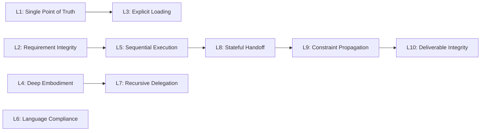
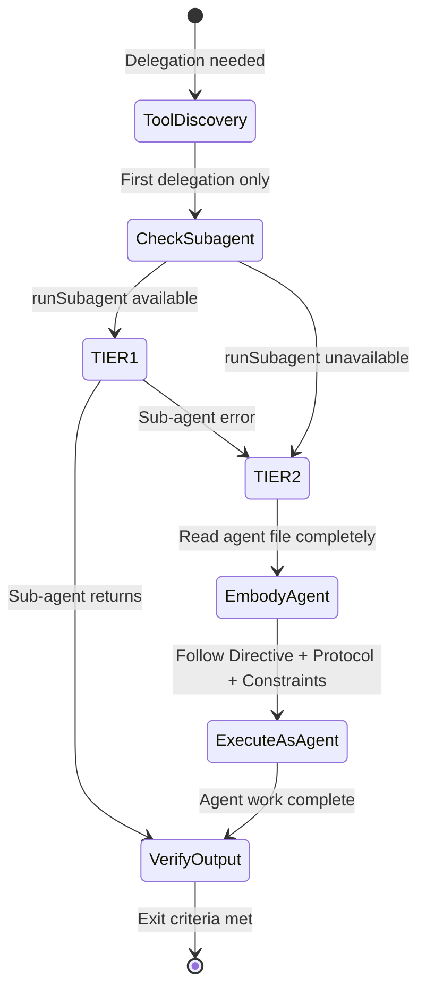
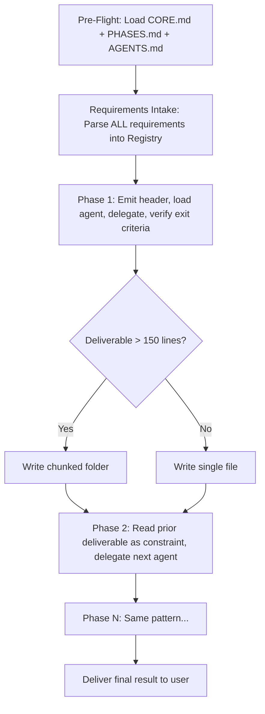
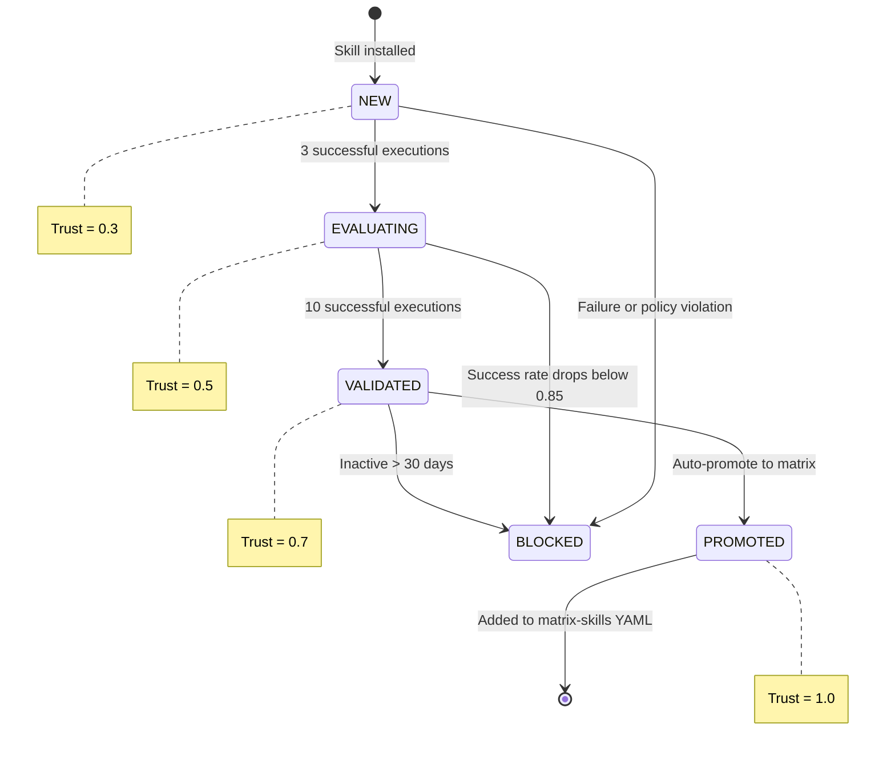
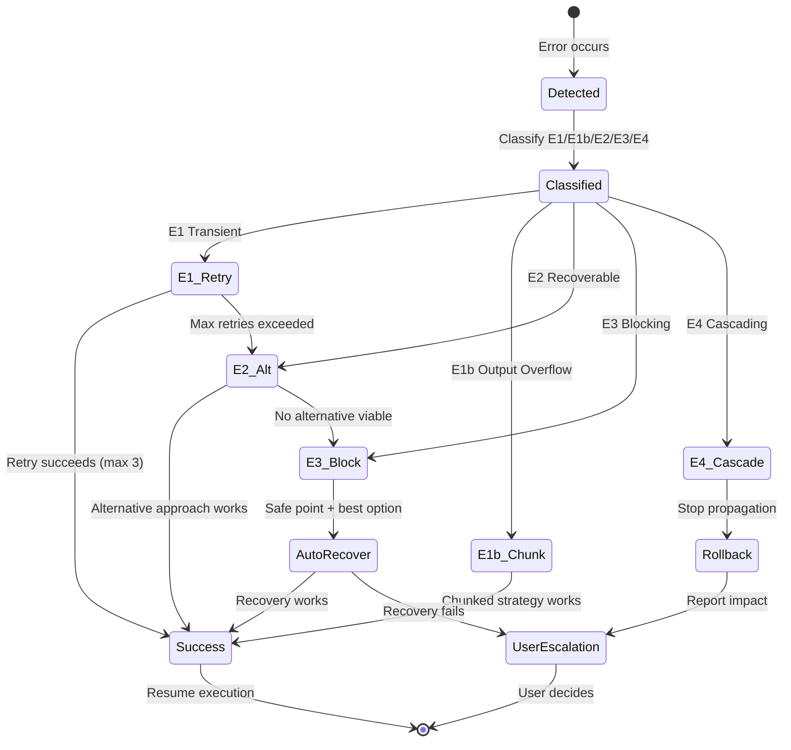
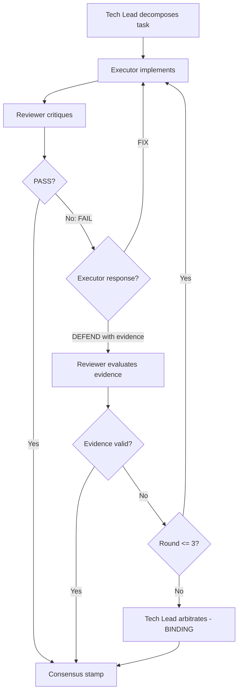
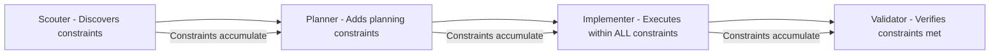

# Agent Assistant — Business Rules

> **Purpose**: Complete business logic documentation — governance laws, execution rules, state machines, and constraint systems
> **Parent**: [00-index.md](./00-index.md)
> **Last Updated**: 2026-03-26
> **Generated By**: docs-core skill

---

## Table of Contents

1. [Orchestration Laws (L1-L10)](#orchestration-laws-l1-l10)
2. [Tiered Execution Rules](#tiered-execution-rules)
3. [Phase Sequencing](#phase-sequencing)
4. [HSOL Fitness Scoring](#hsol-fitness-scoring)
5. [Trust Progression](#trust-progression)
6. [Error Classification (E1-E4)](#error-classification-e1-e4)
7. [Golden Triangle Debate Rules](#golden-triangle-debate-rules)
8. [Deliverable Integrity](#deliverable-integrity)
9. [Language Compliance](#language-compliance)
10. [Constraint Propagation](#constraint-propagation)
11. [Anti-Pattern Registry (A1-A10)](#anti-pattern-registry-a1-a10)

---

## Orchestration Laws (L1-L10)

These 10 laws are immutable governance rules defined in `rules/CORE.md` v4.1. They constrain all Orchestrator and agent behavior. No law can be overridden by any command, variant, or agent.

| Law | Name | Rule | Enforcement |
|-----|------|------|-------------|
| **L1** | Single Point of Truth | The platform entry file loads `CORE.md` first; all other rules load on-demand | Prevents conflicting instructions from multiple sources |
| **L2** | Requirement Integrity | 100% fidelity — parse EVERY requirement, zero loss, no assumptions | Requirements Registry must capture all items before Phase 1 |
| **L3** | Explicit Loading | State what you loaded before using it | Prevents phantom references to unloaded rules/agents |
| **L4** | Deep Embodiment | When embodying an agent (TIER 2), follow that agent's Directive + Protocol + Constraints exactly | Agent file overrides default AI patterns |
| **L5** | Sequential Execution | Phase N must complete (exit criteria met) before Phase N+1 starts | No parallel phase execution, no phase skipping |
| **L6** | Language Compliance | Respond in user's language; code, comments, and report files always in English | Dual-language protocol |
| **L7** | Recursive Delegation | Meta agents (tech-lead, planner) coordinate only — they NEVER implement directly | Prevents single points of failure from meta agents coding |
| **L8** | Stateful Handoff | Prior phase deliverables are IMMUTABLE constraints for subsequent phases | No modifying decisions made by earlier agents |
| **L9** | Constraint Propagation | Scouter → Planner → Implementer chain — constraints tighten, never loosen | Downstream phases cannot relax upstream decisions |
| **L10** | Deliverable Integrity | Files created by an agent define the standard — the deliverable IS the truth | Output artifacts are authoritative |

### Law Dependencies



---

## Tiered Execution Rules

The Orchestrator delegates work to agents through a mandatory two-tier system. TIER 1 is always preferred; TIER 2 is fallback only.

### Tier Definitions

| Tier | Name | When | Mechanism | Context |
|------|------|------|-----------|---------|
| **TIER 1** | Sub-agent | `runSubagent` tool exists on the platform | Isolated sub-agent invocation with fresh context | Isolated from parent |
| **TIER 2** | Embody | Sub-agent tool unavailable or returned error | Orchestrator reads agent file and acts as that agent | Shared with parent |

### Tier Decision Rules



### Prohibitions

| Forbidden | Correct Behavior |
|-----------|-----------------|
| Using TIER 2 when `runSubagent` is available | Attempt TIER 1 first |
| Skipping TIER 1 because task seems "simple" | Always try TIER 1 regardless of task complexity |
| Using TIER 2 for "efficiency" or "token savings" | TIER 1 is mandatory when available |

### TIER 2 Embody Protocol

1. Log: `⚠️ TIER 2: {reason for fallback}`
2. Read agent file completely
3. Extract: Directive, Protocol, Constraints, Output Format
4. Announce embodiment with prescribed format
5. Execute as agent following their protocol
6. Exit embodiment, resume as Orchestrator

### Tool Discovery Caching

Tool discovery (checking if `runSubagent` exists) runs once per session. The result is cached — subsequent delegations skip the check and use the cached tier.

---

## Phase Sequencing

Workflow execution follows strict sequential phase ordering governed by Law L5.

### Execution Loop



### Requirements Registry

Before any phase executes, ALL user requirements must be parsed:

```
| ID | Requirement | Priority | Status |
|----|-------------|----------|--------|
| R1 | {extracted} | H/M/L    | ⏳     |
```

Rule: 100% fidelity — every requirement extracted, no assumptions, no omissions (Law L2).

### Phase Execution Rules

| Rule | Description |
|------|-------------|
| One phase at a time | Execute Phase 1 → Phase 2 → ... sequentially. No batching. |
| Load only current phase's needs | Do not pre-load agents for Phase 2 while executing Phase 1 |
| Prior deliverables are immutable | Read completely, lock as constraint (Law L8) — do not modify |
| Missing required deliverable | Halt with notice, create via appropriate agent first, then resume |
| Emit before execute | Announce phase start before doing work |
| Verify after execute | Check exit criteria after agent completes |
| Continue in same reply | Do not stop between phases — execute all in one response |

### Deliverable Size Management

| Condition | Strategy |
|-----------|----------|
| <= 150 lines AND < 4 sections | Single file |
| > 150 lines OR >= 4 sections | Chunked folder with `00-index.md` |

---

## HSOL Fitness Scoring

The Hybrid Skill Orchestration Layer calculates a fitness score to determine which skills to inject into an agent for a given task.

### Formula

```
fitness = 0.35 × SEMANTIC_MATCH
        + 0.25 × SPECIFICITY
        + 0.20 × TRUST_LEVEL
        + 0.10 × FRESHNESS_SCORE
        + 0.10 × SUCCESS_RATE
```

### Weight Rationale

| Factor | Weight | Why |
|--------|--------|-----|
| Semantic Match | 0.35 | Highest weight — relevance to the actual task is most important |
| Specificity | 0.25 | Specialized skills outperform general ones |
| Trust Level | 0.20 | Matrix skills (trusted) preferred over unproven community skills |
| Freshness | 0.10 | Newer/recently verified skills may reflect current best practices |
| Success Rate | 0.10 | Historical performance indicates reliability |

### Decision Thresholds

| Fitness Range | Decision | Discovery Action |
|---------------|----------|-----------------|
| >= 0.8 | Matrix Sufficient | Execute with matrix skills, skip dynamic discovery |
| 0.75 — 0.8 | Matrix Adequate | Execute with matrix skills, run async discovery as background recommendation |
| < 0.75 | Matrix Insufficient | Blocking discovery — must wait for `find-skills` result before proceeding |

The superiority delta of 0.15 means a dynamic skill must exceed the best matrix skill's fitness by at least 0.15 to be preferred over it.

### Variant-Discovery Matrix

| Variant | Dynamic Discovery |
|---------|-------------------|
| `fast` | Always skipped — matrix only |
| `hard` | Enabled — full resolution |
| `team` | Enabled — full resolution |

### Complexity Gate

| Assessment | Action |
|------------|--------|
| Simple | Skip HSOL resolution — base knowledge sufficient |
| Complex | HSOL resolution mandatory — skipping is a protocol violation |

---

## Trust Progression

Dynamic skills (community-installed via `find-skills`) progress through a trust lifecycle.

### State Machine



### Trust Values

| State | Trust Score | Gate to Next State |
|-------|-------------|-------------------|
| NEW | 0.3 | 3 successful executions |
| EVALUATING | 0.5 | 10 successful executions |
| VALIDATED | 0.7 | Auto-promote when all promotion criteria met |
| PROMOTED | 1.0 | Added to matrix — lifecycle complete |
| BLOCKED | N/A | Manual review required |

### Promotion Criteria (All Required)

| Criterion | Threshold |
|-----------|-----------|
| Minimum executions | >= 10 |
| Minimum success rate | >= 0.85 (85%) |
| Maximum inactive days | <= 30 |
| Automatic | Yes — no human review queue |

### Trust Decay

Trust decays after 90 days of inactivity. This prevents stale skills from maintaining high trust scores.

### Support States

| State | Meaning |
|-------|---------|
| `supported` | Actively maintained and functioning |
| `experimental` | New or untested — use with caution |
| `blocked` | Known issues or policy violations — do not use |

---

## Error Classification (E1-E4)

Defined in `rules/ERRORS.md`, the error classification system ensures every error leads to either successful completion or explicit user decision. Silent halts are forbidden.

### Error Types



### Error Classification Table

| Code | Type | Description | Recovery Action | Max Attempts |
|------|------|-------------|----------------|-------------|
| E1 | Transient | Timeout, network failure, temporary unavailability | Retry with exponential backoff | 3 |
| E1b | Output Overflow | File too large for single creation tool call | Switch to chunked deliverable strategy | 1 (strategy switch) |
| E2 | Recoverable | Logic error, incorrect approach, wrong tool usage | Log error, attempt alternative approach | Until alternative found |
| E3 | Blocking | Critical failure, safe state needed | Save to safe point, pick best recovery option, auto-recover | 1 (then escalate) |
| E4 | Cascading | Error affects downstream phases/agents | Stop propagation immediately, rollback affected work, report | 0 (immediate stop) |

### User Escalation Protocol

When auto-recovery fails (E3) or cascade is detected (E4), the user is presented with options:

```
## ⚠️ BLOCKED — Decision Required
**Error**: {description}
**Impact**: {affected items}
**Options**:
A) {Alternative} — {tradeoff}
B) {Skip with gap} — {limitation}
C) {Provide input} — {what's needed}
D) {Modify requirements} — {suggestion}
```

### Core Principle

Every error must lead to either:
1. Successful completion via automated recovery, OR
2. Explicit user decision with clear options

Silent halts, unexplained terminations, and swallowed errors are forbidden.

---

## Golden Triangle Debate Rules

The Golden Triangle is the team collaboration protocol activated by `:team` variants. It spawns exactly 3 agents per phase.

### Roles

| Role | Agent | Authority | Personality |
|------|-------|-----------|-------------|
| Tech Lead | Domain-specific (see roster) | Final authority on all decisions | Pragmatic, decisive, ships quality |
| Executor | Domain-specific implementer | Owns implementation, must defend work with evidence | Builder mindset, evidence-driven, pushes back |
| Reviewer | Domain-specific critic | Can FAIL submissions, demand fixes, escalate | Skeptical, thorough, assumes defects exist |

### Debate Flow



### Debate Rules

| Rule | Detail |
|------|--------|
| Maximum rounds | 3 per task — after round 3, Tech Lead makes binding decision |
| Defense requirement | Executor must provide technical evidence (benchmarks, specs, code references) |
| "I disagree" without proof | Automatic FAIL — Reviewer wins by default |
| Reviewer rejects valid evidence | Escalation to Tech Lead for arbitration |
| Tech Lead evaluation | Based on evidence quality, not seniority or role |

### Communication Protocol

| Artifact | Owner | Rules |
|----------|-------|-------|
| Shared Task List | Tech Lead | State management for assignments, status, priorities |
| Mailbox | All agents (append-only) | `./reports/{topic}/MAILBOX-{date}.md` — all submissions, reviews, defenses, decisions |

Mailbox rules:
- Append-only — no agent may edit or delete prior exchanges
- All agents read the full Mailbox for shared context
- One Mailbox per phase execution, timestamped by date

### Foundation Enforcement Checkpoints

| Checkpoint | Scope | Rule |
|------------|-------|------|
| C8-TEAMS-01 | BLOCK | Mailbox is append-only and required for all inter-agent exchanges |
| C8-TEAMS-02 | BLOCK | Debate capped at 3 rounds; unresolved disputes escalate to Tech Lead |
| C8-TEAMS-03 | BLOCK | Phase output requires explicit consensus stamp before release |

### Consensus Protocol

Output is released only when one of these conditions is met:

| Condition | Trigger |
|-----------|---------|
| Clean pass | Reviewer approved submission with no disputes |
| Resolved pass | Reviewer approved after Executor fixed issues or defended successfully |
| Arbitrated pass | Tech Lead overrode after max 3 rounds — reasoning documented |

Consensus stamp format: `✅ CONSENSUS: TechLead ✓ | Executor ✓ | Reviewer ✓`

Without this stamp, no phase output is released.

---

## Deliverable Integrity

Governed by Law L10: files created by an agent define the standard.

### Rules

| Rule | Description |
|------|-------------|
| Deliverable IS the truth | The output file is authoritative — it defines what was decided |
| Immutable once complete | Once a phase produces a deliverable, subsequent phases treat it as a locked constraint (Law L8) |
| Format governs quality | Deliverable must match the agent's Output Format specification |
| Size-appropriate strategy | <= 150 lines → single file; > 150 lines → chunked folder with index |

### Deliverable Paths

Research/planning agents write to `./reports/{topic}/` with prescribed naming:

| Agent | Path Pattern |
|-------|-------------|
| brainstormer | `./reports/{topic}/brainstorms/BRAINSTORM-{feature}.md` |
| researcher | `./reports/{topic}/researchers/RESEARCH-{feature}.md` |
| scouter | `./reports/{topic}/scouts/SCOUT-{feature}.md` |
| designer | `./reports/{topic}/designs/DESIGN-{feature}.md` |
| planner | `./reports/{topic}/plans/PLAN-{feature}.md` |
| reporter | `./reports/{topic}/general/REPORT-{type}-{date}.md` |
| debugger | `./reports/{topic}/debugs/DEBUG-{issue}.md` |
| tester | `./reports/{topic}/tests/TEST-{feature}.md` |
| business-analyst | `./reports/{topic}/requirements/REQ-{feature}.md` |
| performance-engineer | `./reports/{topic}/performance/PERF-{component}.md` |

Implementation agents (backend-engineer, frontend-engineer, etc.) write directly to the project's source code.

---

## Language Compliance

Governed by Law L6 — a dual-language protocol.

| Context | Language Rule |
|---------|-------------|
| Response to user | Same language the user used in their request |
| Code and code comments | Always English |
| Files in `./reports/{topic}/` | Always English |
| Files in `./documents/` | Always English |
| Agent file contents | Always English |
| Rule file contents | Always English |

---

## Constraint Propagation

Governed by Law L9 — constraints tighten through the workflow pipeline, they never loosen.

### Pipeline Direction



### Rules

| Rule | Description |
|------|-------------|
| Tighten only | Each phase can ADD constraints but never REMOVE or RELAX constraints from prior phases |
| Scouter findings locked | If a scouter identifies technology X is used, the planner must plan around X |
| Planner decisions locked | If a planner specifies approach Y, the implementer must execute approach Y |
| No renegotiation | An implementer cannot decide to use approach Z instead of planner's approach Y |
| Violation handling | If a downstream agent violates an upstream constraint, self-healing triggers backtrack |

### Ambiguity Handling

When a requirement is ambiguous (before it becomes a constraint):

1. PAUSE execution
2. ASK user for clarification
3. DOCUMENT the decision
4. THEN proceed

Guessing, assuming intent, or skipping unclear items is forbidden.

---

## Anti-Pattern Registry (A1-A10)

Defined in `rules/ERRORS.md`, these are cataloged violations that the self-healing protocol watches for.

| Code | Anti-Pattern | Correct Behavior |
|------|-------------|-----------------|
| A1 | Direct implementation by Orchestrator | Delegate to specialist agent |
| A2 | Workflow bypass (skipping phases) | Follow exact phase order |
| A3 | Silent halt (unexplained stop) | Notify user + provide options |
| A4 | Skipped step within a phase | Backtrack + complete the step |
| A5 | Lazy fallback (using TIER 2 when TIER 1 available) | Attempt TIER 1 first |
| A6 | Assumed requirements | Ask for clarification |
| A7 | Modified prior deliverable | Treat prior deliverables as immutable |
| A8 | Batched phase loading (pre-loading agents) | Load one phase at a time |
| A9 | Meta agent implementing (tech-lead coding) | Meta agents delegate only |
| A10 | Unexplained termination | Always explain + provide options |

### Self-Healing Protocol

When a violation is detected:

1. DETECT violation or error
2. PAUSE at nearest safe point
3. LOG: `⚠️ {violation_code}: {description}`
4. BACKTRACK to correct state if needed
5. RE-EXECUTE correctly
6. UPDATE downstream if affected
7. RESUME normal flow

Maximum corrections per phase: 3. If limit is reached, escalate to user.

---

## Evidence Sources

| Source | Path |
|--------|------|
| Orchestration Laws (L1-L10) | `rules/CORE.md` |
| Tiered Execution protocol | `rules/AGENTS.md` |
| Phase Sequencing rules | `rules/PHASES.md` |
| HSOL configuration (weights, thresholds) | `matrix-skills/_index.yaml` |
| HSOL resolution algorithm | `rules/SKILLS.md` |
| Trust progression and promotion | `rules/SKILLS.md` + `matrix-skills/_index.yaml` |
| Error Classification (E1-E4) | `rules/ERRORS.md` |
| Anti-Patterns (A1-A10) | `rules/ERRORS.md` |
| Golden Triangle protocol | `rules/TEAMS.md` |
| Foundation Enforcement Checkpoints | `rules/TEAMS.md` |
| Deliverable paths | `rules/CORE.md` + `rules/REFERENCE.md` |
| Language compliance | `rules/CORE.md` (Law L6) |
| Constraint propagation | `rules/CORE.md` (Law L9) |
| Ambiguity handling | `rules/CORE.md` |
